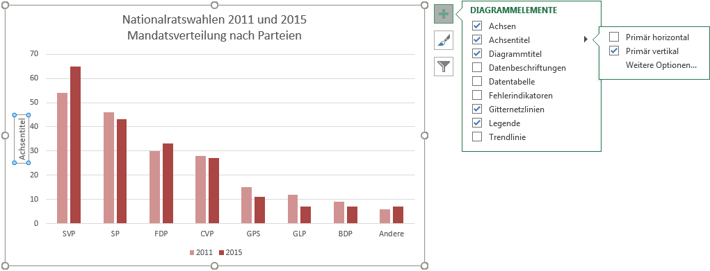

# Achsentitel

Klicke auf das Plus-Symbol, um das Menü «Diagrammelemente» anzuzeigen.
Klicke anschliessend auf den Pfeil :mdi[chevronRight] rechts vom Menüpunkt __Achsentitel__. Setze im nun erscheinenden Untermenü beim gewünschten Achsentitel ein Häkchen.

- __Primär horizontal__: Achsentitel für die horizontale Achse
- __Primär vertikal__: Achsentitel für die vertikale Achse

Grundsätzlich sollten stets beide Achsentitel verwendet werden – ausser, es ist unmissverständlich, worum es sich handelt (z.B. bei Jahrzahlen und Monaten).

Klicke anschliessend auf den umrahmten Achsentitel, um diesen abzuändern.

Durch das Ziehen am Rahmen des Titels kann dieser positioniert und in seiner Grösse angepasst werden.
