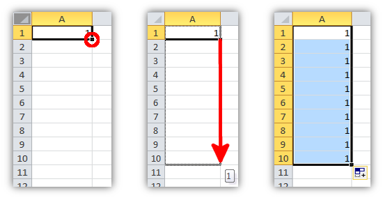
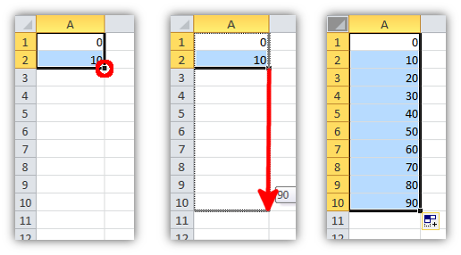
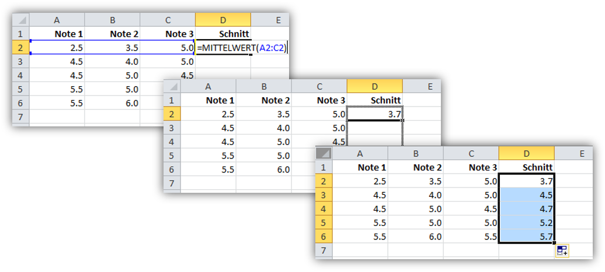

# Automatisches Ausfüllen

Mit dem **automatischen Ausfüllen** können Tabellenbereiche schnell mit einem vordefinierten Wert oder einer Formel ausgefüllt werden.

{/*

<vue-plyr>
  <video controls>
    <source src="./auto-ausfuellen.mp4" type="video/mp4"/>
  </video>
</vue-plyr>

*/}

Um einen Tabellenbereich mit einem konstanten Wert zu füllen, wird dieser Wert in die erste Zelle des Bereichs geschrieben. Anschliessend wird das kleine Quadrat unten rechts der Zellmarkierung gefasst und in die gewünschte Richtung gezogen.

Ein Tabellenbereich kann auch mit einer auf- oder absteigenden Folge von Werten gefüllt werden. Dazu werden die zwei ersten Werte in zwei benachbarte Zellen geschrieben. Anschliessend werden **beide** Zellen ausgewählt. Nun wird wiederum das kleine Quadrat unten rechts der Zellmarkierung gefasst und in die gewünschte Richtung gezogen.

Auch Formeln können so kopiert werden. Dabei werden die Formeln beim Ziehen automatisch an den neuen Zellbereich angepasst. Steht beispielsweise in der Zelle **D2** die Formel `=MITTELWERT(A2:C2)` und wird diese nach unten gezogen, so ergibt sich für **D3** die Formel `=MITTELWERT(A3:C3)`, für **D4** die Formel `=MITTELWERT(A4:C4)` etc.

