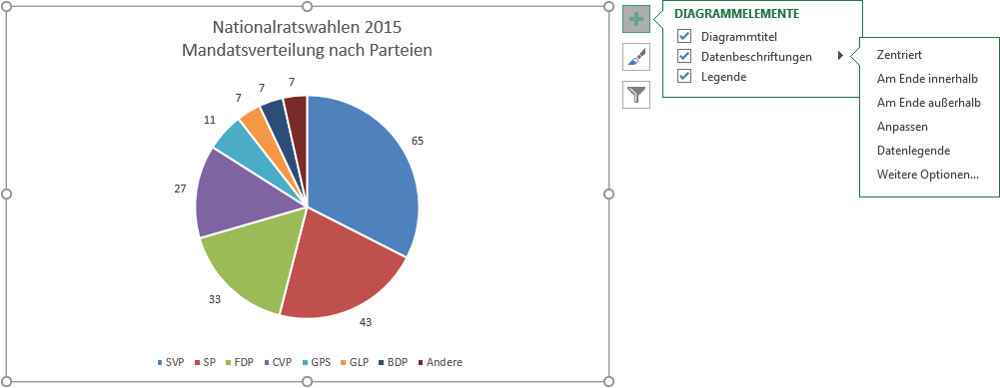

# Datenbeschriftungen

Klicke auf das Plus-Symbol, um das Menü «Diagrammelemente» anzuzeigen.
Klicke anschliessend auf den Pfeil :mdi[chevronRight] rechts des Menüpunktes __Datenbeschriftungen__. Wähle nun die gewünschte Position der Beschriftung:

- __Zentriert__: die Beschriftung wird innerhalb der Fläche zentriert dargestellt
- __Am Ende innerhalb__: die Beschriftung wird innerhalb der Fläche am Rand dargestellt
- __Am Ende ausserhalb__: die Beschriftung wird ausserhalb der Fläche dargestellt

