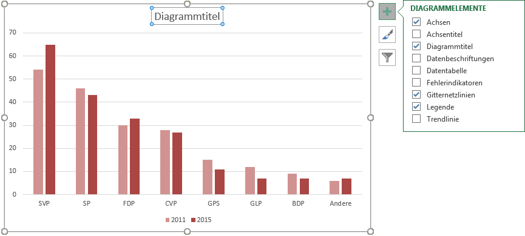

# Diagrammtitel

Klicke auf das Plus-Symbol, um das Menü «Diagrammelemente» anzuzeigen. Setze beim Menüpunkt __Diagrammtitel__ ein Häkchen, falls keiner vorhanden ist.

Klicke anschliessend auf den umrahmten Diagrammtitel, um diesen abzuändern.

Durch das Ziehen am Rahmen des Titels kann dieser positioniert und in seiner Grösse angepasst werden.
