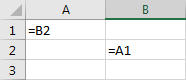

# Formeln

## Formel eingeben

Eine Formel beginnt immer mit einem Gleichheitszeichen:

<ExcelBox>=39+2</ExcelBox>

## Operationen

In Formeln können die Grundrechenoperationen sowie die Potenz verwendet werden:

| Operation      | Zeichen | Beispiel |
| -------------- | ------- | -------- |
| Addition       | `+`     | `=5+2`   |
| Subtraktion    | `-`     | `=5-2`   |
| Multiplikation | `*`     | `=5*2`   |
| Division       | `/`     | `=5/2`   |
| Potenz         | `^`     | `=5^2`   |

Dabei gelten die üblichen Assoziativgesetze der Mathematik.

## Zellbezüge

Um einen Wert aus einer anderen Zelle in einer Formel zu verwenden, wird die Bezeichnung der Zelle angegeben. Die folgende Formel addiert die Werte in den Zellen A2 und B4:

<ExcelBox>=A2+B4</ExcelBox>

## Fehlermeldungen

Wenn das Tabellenkalkulationsprogramm den Wert einer Formel nicht berechnen kann, wird eine Fehlermeldung in der Zelle angezeigt.

| Fehler    | Bedeutung                                            |
| --------- | ---------------------------------------------------- |
| `#WERT!`  | eine verwendete Zelle enthält nicht einen Zahlenwert |
| `Err:522` | es besteht ein zirkulärer Bezug                      |
| `#BEZUG!` | es besteht ein zirkulärer Bezug                      |

Ein zirkulärer Bezug bedeutet, dass die Resultate von zwei Formeln gegenseitig voneinander abhängen, Beispielsweise, wenn in der Zelle A1 die Formel `=B2` und in der Zelle B2 die Formel `=A1` steht:

