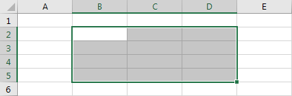

# 'Funktionen'

## Funktionen

Mit *Funktionen* können Berechnungen durchgeführt werden, welche über die Grundrechenoperationen hinausgehen. Beispielsweise kann mit der Funktion `WURZEL(x)` die Quadratwurzel einer Zahl berechnet werden. Die folgende Formel berechnet die Quadratwurzel von 2:

<ExcelBox>=WURZEL(2)</ExcelBox>

In einer Funktion können natürlich auch Zellbezüge verwendet werden. So wird die Quadratwurzel des Wertes in Zelle A1 berechnet:

<ExcelBox>=WURZEL(A1)</ExcelBox>

Der Wert, welcher der Funktion übergeben wird, nennt man **Argument**. Manche Funktionen benötigen mehr als ein Argument. Diese werden durch einen Strichpunkt `;` getrennt.

Die Funktion `RUNDEN` rundet einen Wert auf eine bestimmte Anzahl Dezimalstellen. Dazu muss als erstes Argument der zu rundende Wert und als zweites Argument die Anzahl Dezimalstellen angegeben werden. Die folgende Formel rundet den Wert in A1 auf zwei Dezimalstellen:

<ExcelBox>=RUNDEN(A1; 2)</ExcelBox>

Eine weitere nützliche Funktion ist `VRUNDEN`. Sie rundet einen Wert auf ein Vielfaches eines zweiten Wertes. Um beispielsweise den Wert in der Zelle A1 auf ein Vielfaches von 0.2 zu runden, schreibt man:

<ExcelBox>=VRUNDEN(A1; 0.2)</ExcelBox>

Hier ist eine Übersicht der besprochenen Funktionen:

| Operation                 | Funktion  | Beispiel            |
| ------------------------- | --------- | ------------------- |
| Quadratwurzel             | `WURZEL`  | `=WURZEL(A1)`       |
| Runden auf Dezimalstellen | `RUNDEN`  | `=RUNDEN(A1; 2)`    |
| Runden auf Vielfaches     | `VRUNDEN` | `=VRUNDEN(A1; 0.2)` |

## Funktionen für Zellbereiche

Manche Funktionen werden nicht auf einzelne Werte angewendet, sondern auf **Zellbereiche**. Ein Zellbereich wird angegeben, indem die Bezeichnung der oberen linken Zelle und der unteren rechten Zelle durch ein Doppelpunkt verbunden werden.

Um den Zellbereich von B2 bis D5 anzugeben, schreibt man `B2:D5`.

Die folgenden Funktionen können auf Zellbereiche angewendet werden:

| Operation                          | Funktion     | Beispiel              |
| ---------------------------------- | ------------ | --------------------- |
| Summe                              | `SUMME`      | `=SUMME(A1:A10)`      |
| Mittelwert                         | `MITTELWERT` | `=MITTELWERT(A1:A10)` |
| Maximum (grösste Zahl im Bereich)  | `MAX`        | `=MAX(A1:A10)`        |
| Minimum (kleinste Zahl im Bereich) | `MIN`        | `=MIN(A1:A10)`        |
