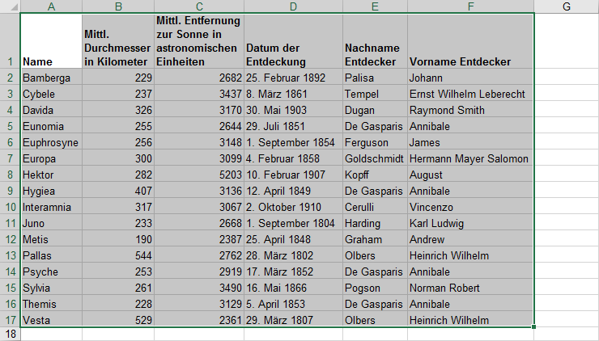
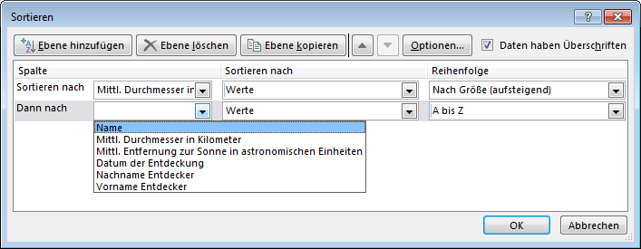

# Sortierung

Wähle zuerst den Bereich des Tabellenblatts aus, welcher sortiert werden soll. Dabei müssen unbedingt sämtliche Zeilen und Spalten, die zur Tabelle gehören, ausgewählt werden (also insbesondere auch die Zeile mit den Überschriften).

Anschliessend wird über den Menüpunkt __Start__ :mdi-chevron-right: __Sortieren und Filtern__ :mdi-chevron-right: __Benutzerdefiniertes Sortieren...__ der Dialog «Sortieren» geöffnet.

In diesem Dialog können mehrere Sortierebenen definiert werden. Für jede Ebene kann die Spalte, nach welcher sortiert werden solli, sowie die Sortierreihenfolge ausgwählt werden:

Beachte, dass das Häkchen oben rechts im Fenster angibt, ob der Bereich eine Überschrift enthält oder nicht. Excel erkennt dies in der Regel automatisch richtig, Es kann aber auch sein, dass du das Häkchen von Hand setzen musst. Nur wenn dieser Häkchen gesetzt ist, werden beim Sortierkriterium die Überschriften verwendet. Sonst wird einfach die Spaltenbezeichnung verwendet.
