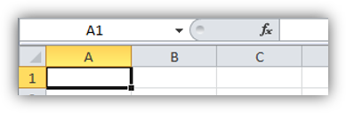
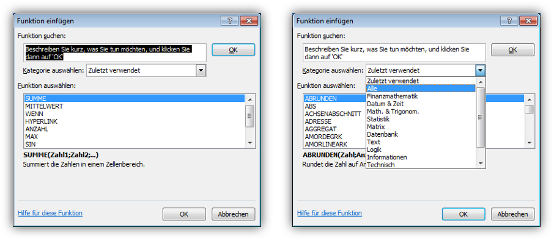
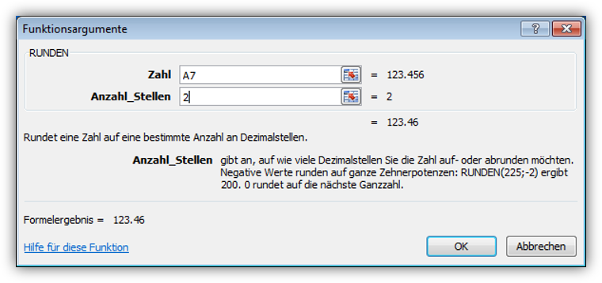
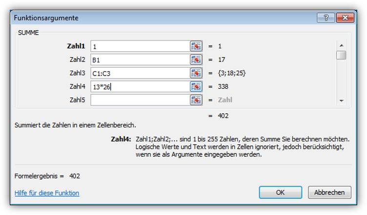

# Weitere Funktionen

## Weitere Funktionen
Es ist klar, dass du dir nicht alle Funktionsnamen auswendig merken kannst. Um alle verfügbaren Funktionen anzuzeigen, klickst du auf das __fx__-Symbol oberhalb der Spaltenüberschriften.

Anschliessend wählst du gewünschte Funktion aus oder – falls nötig – zuerst eine andere Kategorie von Funktionen.

## Argumente eingeben
Wie du bereits im letzten Kapitel erfahren hast, braucht die `RUNDEN`-Funktion zwei Werte, damit sie korrekt rechnen kann (die zu rundende Zahl und die gewünschte Anzahl Nachkommastellen). Dies wird im entsprechenden Dialog so angezeigt. Zudem wird unterhalb der Textfelder die Bedeutung der Argumente erklärt:

Anders als bei `RUNDEN` können der Summenfunktion beliebig viele Argumente übergeben werden. Jedesmal wenn eine Zahl angegeben wird, erscheint sofort ein neues, leeres Feld. Zudem verdeutlicht die folgende Abbildung nochmals, dass in einer Formel als Argument

- Zahlen
- Zellen
- Zellbereiche (falls erlaubt)
- Formeln

vorkommen dürfen:

