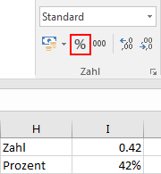

Die Darstellung von Zahlenwerten in einer Zelle kann durch die Wahl eines **Zahlenformats** beeinflusst werden.

:::danger
Auf dieser Seite wird beschrieben, wie man die **Darstellung** ändert. Am Wert, der in der Zelle gespeichert ist, ändert dabei nichts.

D.h. es kann sein, dass eine Zelle den Wert `3.141592654` enthält, dieser aber gerundet auf eine Stelle nach dem Komma dargestellt wird. Für sämtliche Berechnungen wird trotzdem der eingetragene und nicht der dargestellte Wert verwendet.
:::

In Excel wird dazu im Menü __Start__ der Abschnitt __Zahl__ verwendet:

Über das Dropdown-Menü können verschiedene vordefinierte Zahlenformate gewählt werden:

Im Folgenden werden die wichtigsten Darstellungsarten kurz erläutert.

## Zahl

Wird im Dropdown-Menü der Eintrag __Zahlenformat__ ausgewählt, dann wird der Wert als «normale» Zahl dargestellt. Mit den folgenden drei Schaltflächen können die Anzahl Nachkommastellen eingestellt und die Darstellung eines Tausendertrennzeichens ein- und ausgeschaltet werden:

## Prozentwert

Eine Zahl kann auch als Prozentwert dargestellt werden. Dies kann mit der markierten Schaltfläche oder über den Eintrag __Prozent__ im Dropdown-Menü geschehen.

:::danger
Hier ist zu beachten, dass der Prozentwert das hundertfache des Zahlwerts ist. Die Zahl 0.42 entspricht 42%.

:::

## Wissenschaftliche Notation

In der Wissenschaft werden sehr grosse oder sehr kleine Zahlen oft in der sogenannten **wissenschaftlichen Notation** dargestellt. Dabei wird eine grosse Anzahl Nullen durch eine Zehnerpotenz ersetzt. Anstelle von 1'000'000 schreibt man 106, anstelle von 2'490'000 schreibt man 2.49&middot;106.

In Excel wird die wissenschaftliche Notation durch den Eintrag __Exponentialzahl__ im Dropdown-Menü ausgwählt.

## Datum und Zeit

Eine Zahl kann auch als Datum dargestellt werden. Das Datum, welches eine Zahl repräsentiert, ergibt sich, indem die Anzahl Tage seit dem 30. Dezember 1899 gezählt werden. So entspricht die Zahl 366 dem 31. Dezember 1900, die Zahl 43'100 entspricht dem 31. Dezember 2018.
