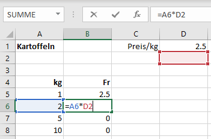

Mit dem **automatischen Ausfüllen** können Tabellenbereiche schnell mit einer Formel ausgefüllt werden.  Dabei werden sämtliche Zellbezüge in der Formal angepasst. Doch wie gehen wir vor, wenn genau das nicht passieren soll?

Beispielsweise wollen wir eine Wertetabelle für Kartoffelpreise unterschiedlicher Mengen (nach Gewicht) herstellen. Dabei ist der Preis/kg gesetzt und wird in die Formel eingesetzt, in die Zelle `B5` schreiben wir daher `=A5*D1`, kopieren die Formel nach unten und sehen sofort, dass etwas nicht stimmt:

Wenn wir die Zelle `B6` genauer anschauen, so bezieht sich diese nun auf `A6` (was korrekt ist) und auf `D2` (was nicht korrekt ist). Die Zelle mit dem Kilopreis soll beim Kopieren erhalten bleiben.

## Zelle benennen
Dies können wir erreichen, wenn wir die Zelle benennen. Dazu klicken wir oberhalb der Spaltenüberschriften in das Feld, das die Zellbezeichnung (hier `D1`) trägt und geben dort einen von uns gewählten Namen (hier `Kilopreis`) ein und drücken die Enter-Taste:

Nun kann anstelle von `D1` dieser Zellname in unserer Formeln verwendet werden. Kopieren wir die neue Formel `=A5*Kilopreis` nach unten, passt sich nur noch der Verweis auf das Gewicht an, die Zelle mit dem Kilopreis bleibt erhalten:

