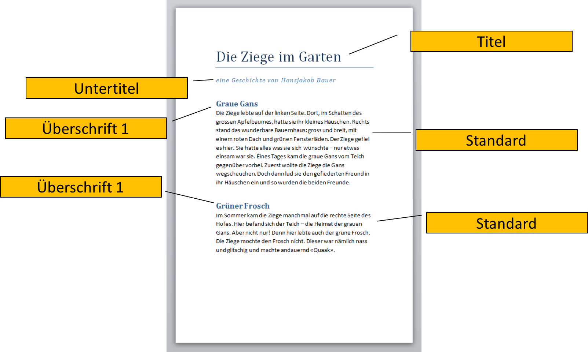

# Formatvorlagen

## Textstruktur

Eine gute Struktur eines Textdokumentes dient nicht nur der besseren Lesbarkeit.

Überschriften werden normalerweise grösser dargestellt als der restliche Text. Dadurch fällt es dem Betrachter leichter, die Struktur eines Textes zu erkennen: Der Beginn eines Kapitels sticht hervor, ein Abschnitt wird eindeutig als Unterkapitel identifiziert.

Die Software hingegen erkennt eine Überschrift nicht an Hand ihrer Darstellung. Umgekehrt allerdings kann die Software eine Überschrift entsprechend als solche darstellen.

Deshalb empfiehlt es sich, ein Dokument zu strukturieren, indem man Überschriften als solche auszeichnet und sie nicht einfach fett und grösser formatiert. Dasselbe gilt für weitere Textelemente wie Absätze, Fussnoten, ...

Die Textverarbeitungssoftware kann dann in der sogenannten *Formatvorlage* nachschauen gehen, wie eine Überschrift formatiert wird. Fügt man nun eine weitere Überschrift hinzu, hat diese bereits die korrekte Darstellung. Zudem kann man an einem zentralen Ort die Darstellung sämtlicher Überschriften anpassen.

---

Durch diese Textstruktur eröffnen sich weitere Möglichkeiten

Inhaltsverzeichnis
: Die Textverarbeitungssoftware kann ein automatisches Inhaltsverzeichnis erstellen, indem sie alle Stellen, die mit der Formatvorlage «Überschrift» gekennzeichnet sind, als Kapitelüberschrift ins Inhaltsverzeichnis kopiert und evtl. zusätzlich die Seitenzahl daneben schreibt.

Screenreader
: Dieser liest Dokumente vor (z.B. für Blinde, Sehbehinderte, aber auch Leute, die nicht lesen können oder wollen). Der Screenreader kann nun die zusätzlichen Informationen wiedergeben, indem er sagt: «Titel: Die Ziege im Garten – Untertitel: eine Geschichte von Hansjakob Bauer – Erstes Kapitel: Graue Gans – Die Ziege lebte…»

## Formatvorlagen
Formatvorlagen geben dem Dokument eine Struktur: Durch Kennzeichnen von Überschriften können Kapitel erstellt werden und Absätze strukturieren den Text. Daneben werden Formatvorlagen aber auch verwendet, um das Aussehen des Dokumentes zu gestalten. Wir unterscheiden Formatvorlagen auf zwei Stufen:

## Stufe «Zeichen»

Hier können alle Einstellungen, die für einzelne Zeichen gelten, gesetzt werden. Also etwa

* Schriftart, -grösse, -farbe
* Schriftvariante (kursiv, fett)
* Dekoration (unterstrichen, durchgestrichen)
* Zeichenfarbe
* …

## Stufe «Absatz»
Hier werden alle Einstellungen, die für ganze Absätze gelten, gesetzt. Also etwa

* Einzug links/rechts
* Abstand vor oder nach Absatz
* Zeilenabstand
* Ausrichtung (links, rechts, zentriert, block)
* Schriftfarbe
* Rahmen
* …

Häufig setzt man in den Formatvorlagen auf Stufe «Absatz» gleich auch die Einstellungen für einzelne Zeichen. Diese Einstellungen könnten aber im Text – durch Anwenden einer Formatvorlage der Stufe «Zeichen» – für einzelne Buchstaben/Wörter überschrieben werden (z.B. zum Hervorheben eines wichtigen Begriffs).

## Weitere Formatvorlagen
Je nach Textverarbeitungsprogramm existieren weitere Formatvorlagen für andere Elemente des Dokumentes, z.B. für Listen oder Tabellen.
