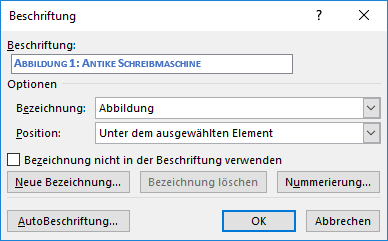
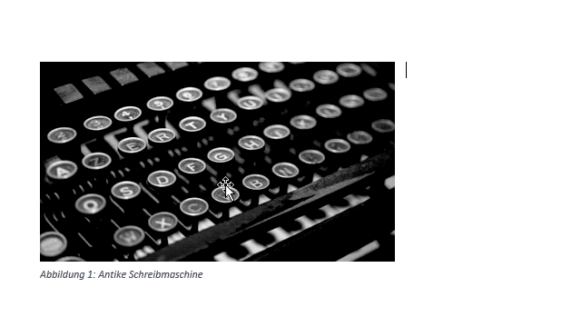
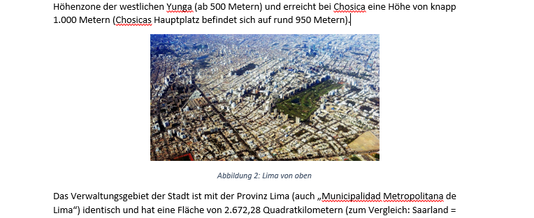

# Beschriftungen

## Beschriftung einfügen

:::warning Achtung

Wenn der _Textumbruch_ des Bildes auf _Mit Text in Zeile_ gestellt ist, wird die Beschriftung in den Fliesstext eingefügt. Das ist normalerweise nicht erwünscht.

Daher empfiehlt es sich, vorher den Textfluss des Bildes anzupassen.

:::

Du wählst das Bild aus, dann machst du entweder einen Rechtsklick darauf und wählst __Beschriftung einfügen…__ oder du gehst über das Menu __Referenzen__ :mdi-chevron-right: __Beschriftung einfügen__. Bei Tabellen funktioniert nur der Weg über das Menu. Das folgende Fenster erscheint:

Im ersten Feld musst du einen Text für die Beschriftung eingeben. Je nach gewählter Bezeichnung wird diese dem Text automatisch mit einer Nummer vorangestellt. Es empfiehlt sich, ein Trennzeichen (z.B. Doppelpunkt gefolgt von einem Leerzeichen) zwischen Nummer und Text einzufügen. Zusätzlich kannst du unter _Position_ wählen, ob die Beschriftung ober- oder unterhalb des Elementes eingefügt werden soll.

## Bild und Beschriftung gruppieren

Bei Elementen **ausserhalb des Textflusses** fügt Word die Beschriftung als Textfeld ober- oder unterhalb des Elements ein.

Verschiebst du aber Bild oder Beschriftung, passen diese nicht mehr zusammen. Deshalb musst du **die beiden Elemente unbedingt gruppieren!** Dazu wählst du beide Elemente aus. Dies erreichst du durch Klick auf das erste Element, dann mit gedrückter [[Shift]]-Taste auf das zweite Element klicken. Beide Elemente sollten jetzt markiert sein.

Anschliessend machst du einen Rechtsklick auf die markierten Elemente und wählst __Gruppieren__ :mdi-chevron-right: __Gruppieren__.

Du kannst den Textfluss, den Abstand zum Text sowie auch Grösse und Position wie gewohnt verändern. Dabei gilt es aber zu beachten, dass du jeweils die gesamte Gruppe, also Bild und Beschriftung wählst, und nicht nur das Bild oder die Beschriftung selbst.

Um die Beschriftung selbst zu ändern, kannst du direkt in die Beschriftungszeile klicken und Änderungen anbringen. Hier kannst du auch die Ausrichtung der Beschriftung ändern. Wenn du aber alle Beschriftungen im Dokument anpassen möchtest, dann solltest du besser die Formatvorlage «Beschriftung» anpassen. Sie wird allen Beschriftungen beim Einfügen zugewiesen.

## Beschriftung im Textfluss

Falls das Element **im Textfluss** ist, wird die Beschriftung auf die nächste Zeile in den normalen Textfluss integriert. Dies eignet sich für grössere Bilder, welche die gesamte Breite des Dokumentes belegen:

