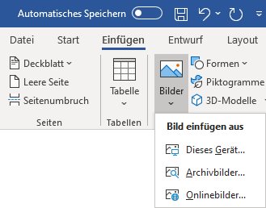
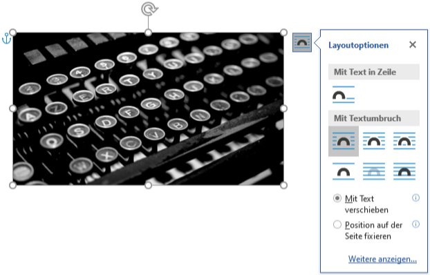
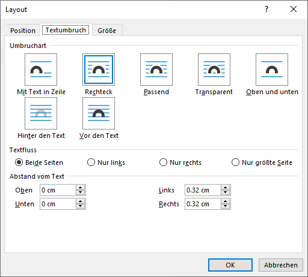

---
tags:
  - Bilder
  - Textfluss
apps:
  - Microsoft Word
sidebar_position: 5
sidebar_custom_props:
  icon: mdi-image-plus
  source: gym-kirchenfeld
  path: /docs/textverarbeitung/word-1/bilder/README.md
draft: false
---

# Bilder

Bilddateien lassen sich in allen modernen Textverarbeitungsprogrammen problemlos einfügen, sei es aus einer lokalen Datei oder über die Zwischenablage. Unterstützt werden diverse Formate, die gängigsten sind **jpg**, **png**, **gif** und **svg**.

## Bilder einfügen
Bilder können über die Zwischenablage mit [[Ctrl]] + [[V]] oder über __Einfügen__ :mdi-chevron-right: __Bilder__ als Datei eingefügt werden.

## Textfluss festlegen

Wenn man ein Bild anklickt, erscheint ein kleines Symbol, womit man den Textfluss um dieses Bild festlegen kann:

Standardmässig ist bei eingefügten Bildern der Textfluss «Mit Text in Zeile» aktiv. Dies bedeutet, dass das Bild wie ein Wort in der aktuellen Zeile steht. Dies führt dazu, dass diese Zeile in den meisten Fällen weit vom restlichen Text abgesetzt ist, weil das Bild viel höher ist als der Text. Daher muss der Textfluss in der Regel für jedes Bild von Hand angepasst werden. Meist verwendet man entweder «Quadrat» (also der Text fliesst um das Bild, siehe Screenshot oben) oder «Oben und unten» (kein Text neben dem Bild).

Ein Klick auf __Weitere anzeigen__ oder ein Rechtsklick auf das Bild und __Grösse und Position__ :mdi-chevron-right: __Textumbruch__ öffnet das Layout-Fenster mit den Detaileinstellungen:

Hier kann man neben der Art des Textflusses auch den Abstand des Bildes zum Text definieren.

Siehe auch: [Beschriftungen](../beschriftungen)
