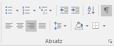
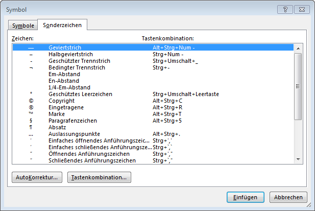

---
tags:
  - Leerzeichen
  - Bindestrich
  - Trennstrich
  - Zeilenwechsel
  - Formatierungszeichen
apps:
  - Microsoft Word
sidebar_position: 8
sidebar_custom_props:
  icon: mdi-format-pilcrow
  source: gym-kirchenfeld
  path: /docs/textverarbeitung/word-1/formatierungszeichen/README.md
draft: true
---

# Formatierungszeichen

## Formatierungszeichen anzeigen

Textdokumente enthalten sogenannte Formatierungszeichen. Diese werden standardmässig nicht angezeigt und selbstverständlich auch nicht ausgedruckt, steuern aber den Textfluss. Man kann sich diese versteckten Zeichen zur besseren Orientierung anzeigen lassen: __Start__ :mdi-chevron-right: __Absatz__ :mdi-chevron-right: __¶__.

## Die wichtigsten Formatierungszeichen

Eine Auswahl an wichtigen Formatierungszeichen:

| Zeichen                 |      Darstellung      |                                                                                                                                                                                                                                                                    |
| ----------------------- | :-------------------: | ------------------------------------------------------------------------------------------------------------------------------------------------------------------------------------------------------------------------------------------------------------------ |
| Leerzeichen             | <code>&middot;</code> | In einem normalen Text sollte immer nur ein Leerzeichen zwischen zwei Wörtern stehen. Zudem erkennst du, wenn ein Satz mit einem Leerschlag beginnt.                                                                                                               |
| geschütztes Leerzeichen |          `°`          | Ein geschütztes Leerzeichen ist ein Leerzeichen, bei welchem die Zeile nicht umgebrochen werden darf. Du kannst es z.B. in Telefonnummern oder bei Massangaben wie «CHF&nbsp;10.–» oder «44&nbsp;g» verwenden, damit der Wert nicht von der Einheit getrennt wird. |
| Zeilenwechsel           | <code>&#8629;</code>  | siehe  [Absatz- vs. Zeilenwechsel](../../allgemein/absatz-vs-zeilenwechsel)                                                                                                                                                                                        |
| Absatzwechsel           |    <code>¶</code>     | siehe  [Absatz- vs. Zeilenwechsel](../../allgemein/absatz-vs-zeilenwechsel)                                                                                                                                                                                        |
| geschützter Bindestrich | <code>&#8722;</code>  | Ein geschützter Bindestrich ist ein Bindestrich, nach dem kein Zeilenwechsel stattfinden darf.                                                                                                                                                                     |
| bedingter Trennstrich   |  <code>&#172;</code>  | Ein bedingter Trennstrich hilft der automatischen Silbentrennung, indem er die korrekte Stelle angibt, an welcher ein Wort getrennt werden darf. Du kannst ihn verwenden, falls die automatische Silbentrennung fehlschlägt.                                       |
| Tabulator               | <code>&#10141;</code> | Springt zum nächsten Tabstopp.                                                                                                                                                                                                                                     |

## Formatierungszeichen einfügen
Während normale Leerschläge und Tabulatoren mit den entsprechenden Tasten eingetippt werden, braucht es bei Zeilenumbrüchen bereits eine Tastenkombination, nämlich [[shift]] + [[return]]. Einige weitere Formatierungszeichen können über das Fenster «Symbol» eingefügt werden. Dieses lässt sich über __Einfügen__ :mdi-chevron-right: __Symbol__ :mdi-chevron-right: __weitere Symbole…__ anzeigen:

