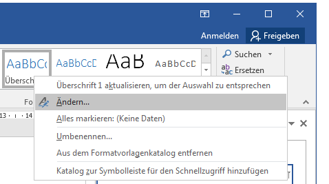
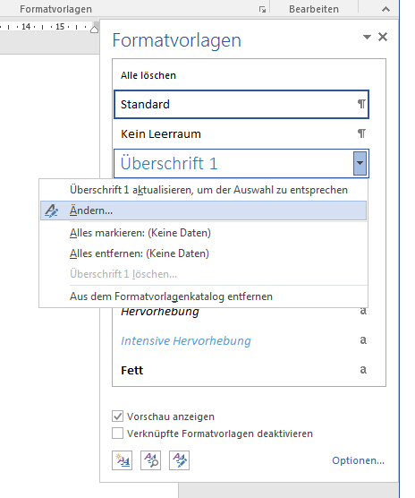
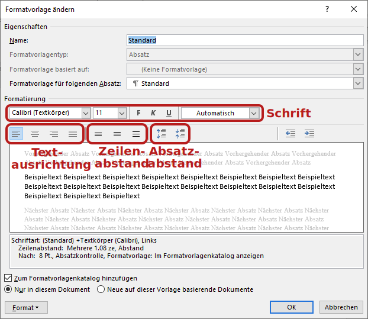

# Formatvorlagen ändern

:::tip
Vor dem Gestalten eines Dokumentes durch Anpassen der Formatvorlagen solltest du sicherstellen, dass dein Dokument keine Direktformatierungen enthält. Sonst können die Formatvorlagen nicht korrekt angewandt werden.
Falls du noch Direktformatierungen in deinem Dokument hast, dann empfiehlt es sich, den Text zuerst zu säubern (siehe Tipp [Text säubern](../../word-2/text-saeubern/)) und dann erst die Formatvorlagen zuzuweisen (siehe Tipp [Formatvorlagen zuweisen](../formatvorlagen-zuweisen/)).
:::

## Formatvorlagen ändern

Mache einen Rechtsklick auf die zu ändernde Formatvorlage in der Registerkarte «Start» und wähle __Ändern…__

oder klicke auf den Dropdown-Pfeil der zu ändernden Formatvorlage im Formatvorlagenfenster und wähle __Ändern…__

## Einstellungen Formatvorlage

Die wichtigsten Einstellungen der Formatvorlage kannst du im folgenden Fenster vornehmen:

Der Knopf __Format__ bietet Zugriff auf alle Einstellungen, die sich anpassen lassen.
