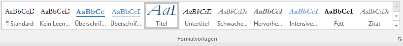
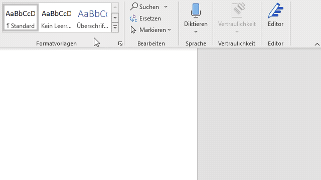
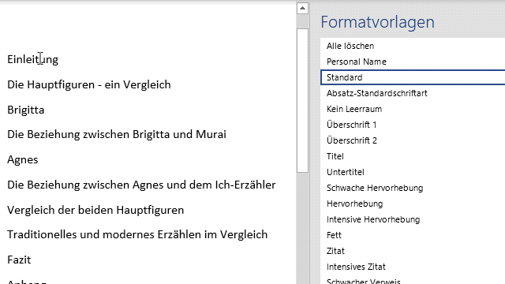
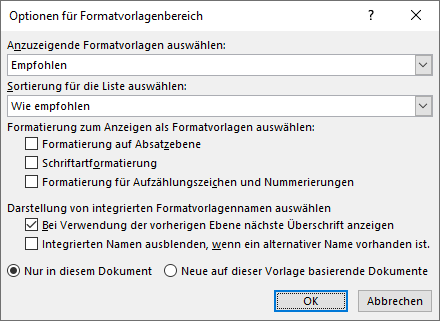

# Formatvorlagen zuweisen

:::warning
Eventuell empfiehlt es sich, den Text zuerst zu säubern (siehe [Text säubern](../../word-2/text-saeubern/)).
:::

Formatvorlagen können sehr einfach zugewiesen werden:

* Zuerst markierst du den Text, dem du eine Formatvorlage zuweisen möchtest.
* Dann klickst du auf die entsprechende Formatvorlage.

Für die Auswahl der Formatvorlage stehen zwei Möglichkeiten zur Verfügung:

## Registerkarte
Im Menü __Start__ hast du einen schnellen Zugriff auf die häufigsten Formatvorlagen. Du siehst auch gleich, welche Vorlage dem momentan markierten Text zugewiesen ist. Die Auswahl lässt sich rechts über den hellgrauen Button (Pfeilspitze nach unten mit Querstrich) erweitern.

## Seitenleiste Formatvorlagen

Sehr bequem zum Arbeiten ist Seitenleiste _Formatvorlagen_. Hier sind alle Formatvorlagen in einer Liste aufgeführt und können durch einen einzigen Klick dem aktuellen Absatz zugewiesen werden:

Um die Seitenleiste einzublenden, musst du auf die untere rechte Ecke im Menübereich _Formatvorlagen_ klicken. Anschliessend kannst du die Seitenleisten ganz an den Rand ziehen, um sie dort zu verankern.

## Formatvorlage zuweisen

Gehe so vor, um einem Absatz eine Formatvorlage zuzuweisen:

- Klicke den Absatz an.
- Klicke auf die gewünschte Formatvorlage in der Seitenleiste.

## Weitere Einstellungen

Weitere Einstellungen können über __Optionen…__ erreicht werden. Hier lässt sich beispielsweise einstellen, ob die empfohlenen, die im Dokument verwendeten oder alle verfügbaren Formatvorlagen angezeigt werden sollen.

