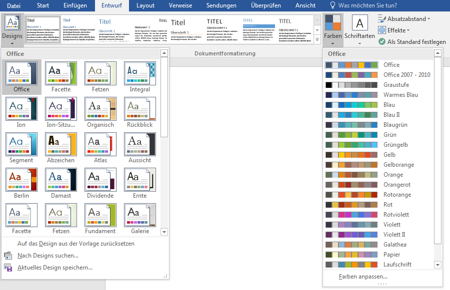

# Formatvorlagensatz wählen

Um das Aussehen deines Dokuments zu ändern, kannst du einen anderen Formatvorlagensatz auswählen. Im Menü __Entwurf__ findest du eine Auswahl von Formatvorlagensätzen:

Durch einen Klick kannst du den entsprechenden Satz aktivieren.

:::tip
Diese Formatvorlagensätze können auf bestehende Dokumente angepasst werden. Aber nur, wenn dort korrekt mit Formatvorlagen gearbeitet wurde! Jede direkte Formatierung führt zu Problemen beim Anwenden eines neuen Designs!
:::
