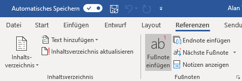

Fussnoten dienen dazu, Erklärungen zu einem Begriff im Text zu liefern, ohne dabei beim Lesen des eigentlichen Textes zu stören. Die Erklärung wird nicht direkt im Satz dargestellt, sondern unten an der Seite oder am Ende des Dokuments. Eine kleine, hochgestellte Zahl direkt hinter dem entsprechenden Begriff weist die Leserin oder den Leser auf die Existenz einer entsprechenden Erklärung hin.

## Fussnote einfügen

Fussnoten werden im Menü __Referenzen__ mit dem Menüpunkt __Fußnote&nbsp;einfügen__ eingefügt.

## Endnote einfügen

Mit dem Menüpunkt __Endnote&nbsp;einfügen__ wird eine Endnote eingefügt. Fussnoten werden unten auf der Seite platziert, **Endnoten** werden am Ende des Dokumentes gesammelt.
