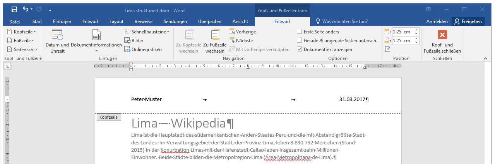

# Kopf- und Fusszeile

Jedes Dokument besitzt grundsätzlich eine Kopf- und eine Fusszeile. Normalerweise sind diese – bis auf die Tabstopps in der Mitte und rechts – leer. Die Kopfzeile erscheint auf jeder Seite des Dokumentes und eignet sich besonders für Zusatzinformationen.

## Kopf- und Fusszeile bearbeiten
Durch einen Doppelklick auf den Bereich der Kopf- oder Fusszeile (also im obersten oder untersten Bereich einer Seite) wird diese zur Bearbeitung geöffnet:

## Elemente einfügen
Die folgenden Elemente gehören auf jedes Dokument – am Besten in die Kopf- oder Fusszeile:

Autor
: Wer hat das Dokument verfasst?
: Dein Name und deine Klasse, ev. das Fach.
: am Besten linksbündig in die Kopfzeile.
: von Hand reinschreiben.

Datum
: Wann wurde das Dokument geschrieben?
: Aktuelles Datum.
: am Besten Rechtsbündig in die Kopfzeile.
: über den Button __Datum und Uhrzeit__ einfügen lassen oder von Hand schreiben.

Seitenzahl
: Bei mehrseitigen Dokumenten gehört eine Seitenzahl in die Fusszeile!
: Muss über den Button __Seitenzahl__ eingefügt werden.
: (Kann nicht von Hand geschrieben werden, da auf jeder Seite eine andere Seitenzahl stehen muss!)

:::warning Felder
Die Seitenzahl und – je nach Einfügeart – auch das Datum, sind sogenannte **Felder**. Dies sind Inhalte, die von Word automatisch generiert werden. So ersetzt Word das Feld «Seitenzahl» auf jeder Seite mit der korrekten Zahl.

Mehr dazu: [Felder einfügen](/textverarbeitung/word-2/felder-einfuegen/)
:::
