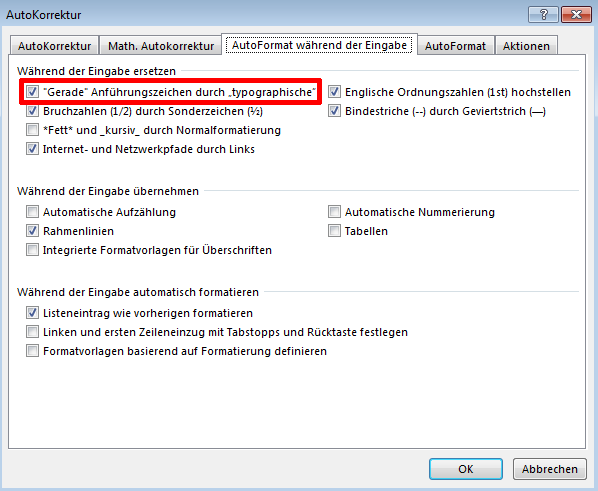
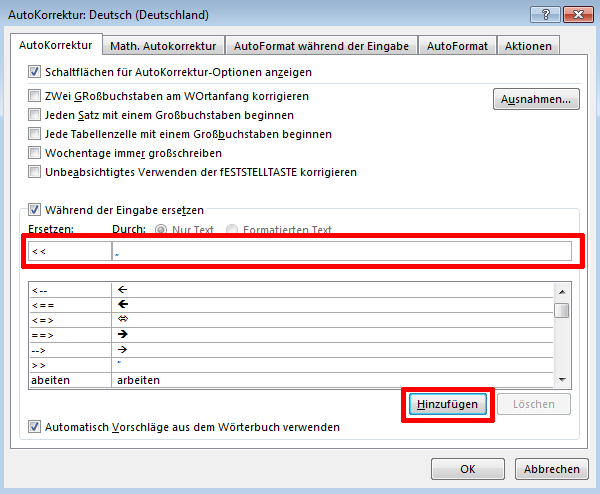

# 'Anführungszeichen'

<PageTitle />

## Autokorrektur-Optionen öffnen

Das Verhalten von Word bezüglich automatischer Ersetzungen während der Eingabe kann in den Autokorrektur-Optionen geändert werden. Diese werden wie folgt geöffnet:

1. Menüpunkt Datei / Optionen auswählen
2. In den Word-Optionen die Seite «Dokumentprüfung» wählen
3. Auf den Knopf «AutoKorrektur-Optionen» klicken

## Automatische Ersetzung während der Eingabe

*Word* ersetzt bei der Eingabe automatisch die geraden Anführungszeichen „...“ durch typographische "...".
Dieses Verhalten kann in den Autokorrektur-Optionen ein- oder ausgeschaltet werden:

## Art der Anführungszeichen

Die Art der verwendeten Anführungszeichen hängt von der eingestellten Dokumentsprache ab. Für die Dokumentsprache «Deutsch (Schweiz)» verwendet Word 2016 andere Anführungszeichen als frühere Word-Versionen, nämlich die französischen Guillemets «...», welche in der Schweiz beispielsweise für offizielle Dokumente und Zeitungen verwendet werden. Frühere Word-Versionen verwendeten die deutschen Anführungszeichen „...“.

## Benutzerdefinierte Anführungszeichen verwenden

Um in Word 2016 für die Dokumentsprache «Deutsch (Schweiz)» die deutschen Anführungszeichen „...“ zu verwenden, muss zu einem Trick gegriffen werden. Es werden eigene Autokorrketur-Regeln definiert, welche eine frei wählbare Zeichenkombination durch die gewünschten Anführungszeichen ersetzt. Wir empfehlen, folgende Regeln zu definieren:

- << ersetzen durch „
- \>> ersetzen durch “

Vorgehen:

1. Autokorrketur-Optionen öffnen (siehe oben)
2. «Während der Eingabe ersetzen» aktivieren
3. Im Feld «Ersetzen» << eingeben
4. In das Feld «Durch» das Anführungszeichen „ einfügen (von hier kopieren)
5. Auf «Hinzufügen» klicken
6. Die zweite Regel analog hinzfügen.

Nun kann in einem Word-Dokument << oder >> getippt werden, um die gewünschten Anführungszeichen zu erzeugen.
