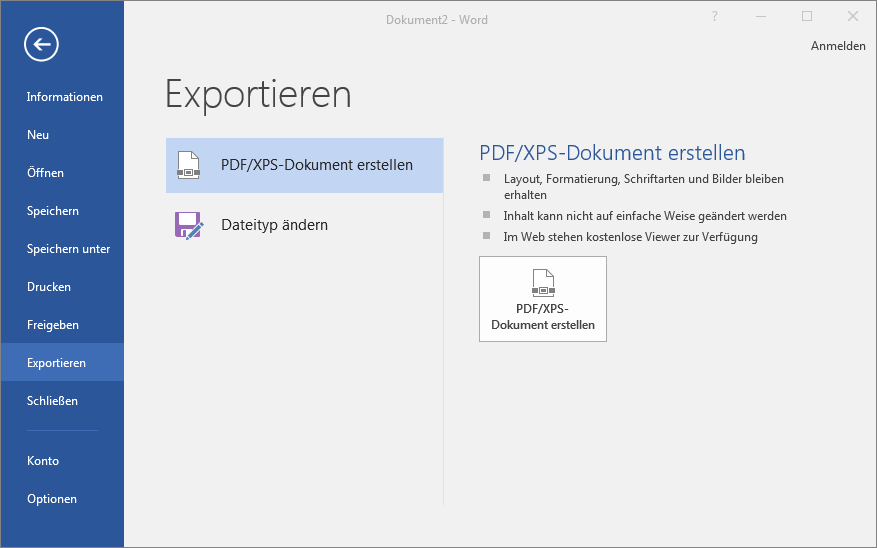
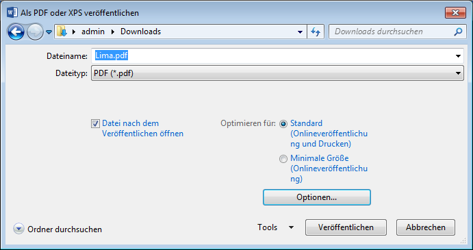

# Endprodukt als PDF

## Wieso?
Einen mit einer Textverarbeitung geschriebenen Text liefert man entweder in Papierform oder als PDF-Datei ab. Die Original-Dokumente werden nur verschickt, wenn der Empfänger sie weiterbearbeiten muss!

Der grosse Vorteil dabei: PDF-Dokumente können auf allen Systemen dargestellt werden (Windows, Linux, macOS, Smartphone, Web). D.h. der Empfänger muss kein Microsoft Office oder LibreOffice installiert haben, um den Text zu lesen.

## Wie?
Du wählst __Datei__ :mdi-chevron-right: __Exportieren__ und klickst auf __PDF/XPS-Dokument erstellen__.

Anschliessend gibst du einen Dateinamen für das zu erstellende PDF-Dokument ein. Du kannst das PDF-Dokument entweder in hoher Qualität (Standard) oder in niedrigerer Qualität (Minimale Grösse) veröffentlichen. Dies spielt vor allem dann eine Rolle, wenn dein Dokument viele Bilder beinhaltet. Diese können nämlich komprimiert und heruntergerechnet werden, so dass das erzeugte PDF viel weniger Speicherplatz belegt.

