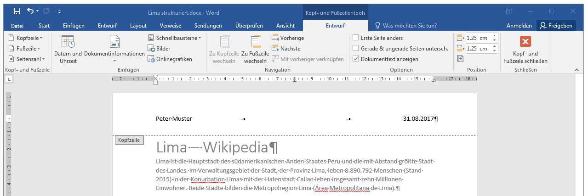
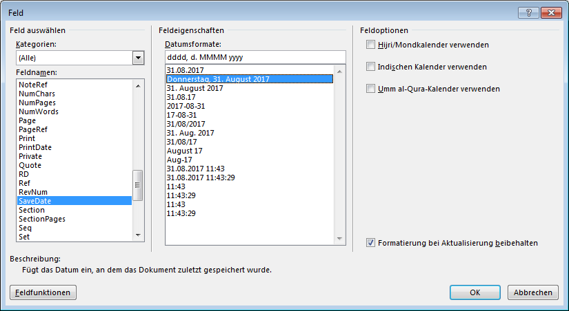
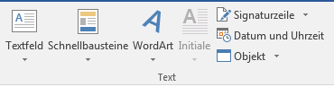

# Felder einfügen

Jedes Dokument besitzt grundsätzlich eine Kopf- und eine Fusszeile. Normalerweise sind diese – bis auf die Tabstopps in der Mitte und rechts – leer.

## Kopf- und Fusszeile editieren
Durch einen Doppelklick auf den Bereich der Kopf- oder Fusszeile (also im obersten oder untersten Bereich einer Seite) wird diese zur Bearbeitung geöffnet:

## Felder einfügen
Wenn die Kopf- und Fusszeilentools geöffnet sind (siehe Screenshot oben), dann hat man über das Menuband __Entwurf__ die Möglichkeit, die häufigsten Felder über __Datum und Uhrzeit__ oder __Dokumentinformationen__ einzufügen.

Über __Dokumentinformation__ :mdi-chevron-right: __Feld…__ erhält man eine Übersicht über alle verfügbaren Felder:

Teilweise gibt es Optionen und Formate, z.B. bei Daten kann das Datumsformat gewählt werden.

Diese Übersicht erreicht man auch über das Dropdown __Schnellbausteine__, das auch im Menuband __Einfügen__ in der Gruppe __Text__ zur Verfügung steht.

## Felder verwalten
Felder werden grau hinterlegt dargestellt. Mit einem Rechtsklick und __Feld bearbeiten…__ kann man das Feld oder sein Format **anpassen**. Über den Rechtsklick lässt sich das Feld auch **aktualisieren**. Dies geschieht je nach Feld aber auch automatisch, resp. beim Drucken, Speichern oder sonst einer Aktion.
