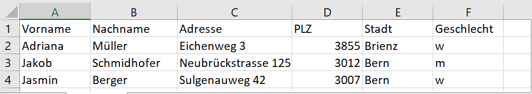
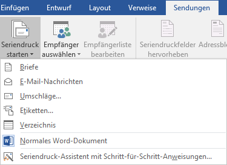
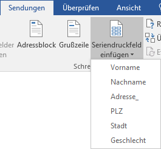
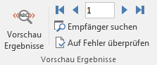
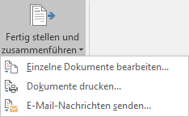

## Vorgehen

Um einen Serienbrief zu erstellen, müssen die folgenden drei Arbeitsschritte ausgeführt werden:

- Tabelle mit geeigneten Titeln erstellen
- Fertige Tabelle lokal abspeichern
- Textdokument mit Bezugsfeldern erstellen

## 1 – Tabelle erstellen

Beim Erstellen der Datentabelle in Excel sollte darauf geachtet werden, dass geeignete Spaltenüberschriften gewählt werden:

Die Tabelle muss ansliessend lokal gespeichert werden, idealerweise im gleichen Ordner, wo auch das Word-Dokument für den Seriendruck gespeichert wird.

## 2 – Word-Dokument erstellen

Der eigentliche Seriendruck findet in **Word** statt. Also wird nun Word gestartet und ein neues Dokument erstellt.

## 3 – Seriendruck aktivieren

Um in einem Word-Dokument den Seriendruck zu aktivieren, wird der Menüpunkt __Sendungen__ :mdi-chevron-right: __Seriendruck starten__ ausgewählt:

Anschliessend kann die gewünschte Dokumentart (z.B. Briefe) ausgewählt werden.

## 4 – Empfänger auswählen

Als nächstes muss die Excel-Tabelle mit den Empfängern ausgewählt werden. Die geschieht über den Menüpunkt __Sendungen__ :mdi-chevron-right: __Empfänger auswählen__ :mdi-chevron-right:  __Vorhandene Liste verwenden...__:

Anschliessend kann die gewünschte Excel-Datei mit den Adressen ausgewählt werden.

## 5 – Seriendruckfelder einfügen

Nun können die Spalten aus der Excel-Tabelle als **Seriendruckfelder** eingefügt werden. Unter dem Menüpunkt __Sendungen__ :mdi-chevron-right: __Seriendruckfeld einfügen__ steht eine Liste aller vorhandenen Spalten zu Verfügung:

## 6 – Vorschau aktivieren

Mit dem Menüpunkt __Sendungen__ :mdi-chevron-right: __Vorschau Ergebnisse__ kann die Vorschau ein- und ausgeschaltet werden. So kann überprüft werden, wie die fertigen Dokumente für jeden einzelnen Empfänger aussehen werden.

## 7 – Drucken

Mit dem Menüpunkt __Sendungen__ :mdi-chevron-right: __Fertig stellen und zusammenführen__ kann der fertige Serienbrief gedruckt werden:

