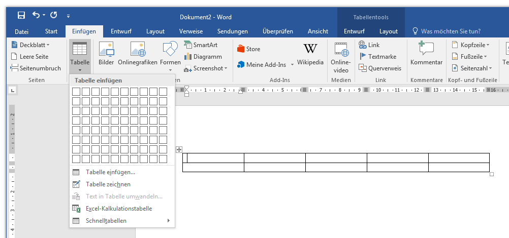
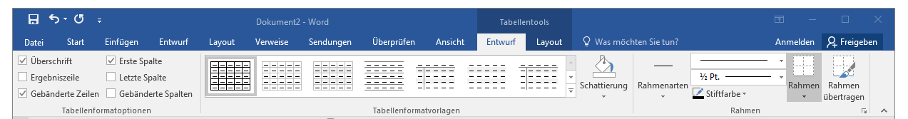
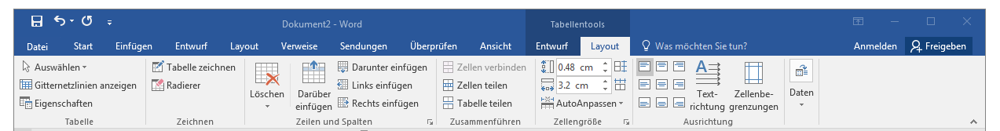

# Tabellen einfügen

## Tabellen einfügen
Du wählst __Einfügen__ :mdi-chevron-right: __Tabelle__, dann kannst du direkt die Anzahl Zeilen und Spalten markieren und die Tabelle wird mit der gewählten Dimension eingefügt.

## Tabelle formatieren
Wenn man eine Tabelle anklickt, erscheint ein neues Menuband __Entwurf__. Hier können Vorlagen und Optionen für die Tabelle gewählt sowie Hintergrund und Rahmen bestimmt werden.

## Tabelle editieren
Wenn man eine Tabelle anklickt, erscheint ein neues Menuband __Layout__. Hier können Zeilen und Spalten gelöscht und eingefügt, Zellen verbunden und geteilt sowie Breite und Textausrichtung gesetzt werden.

---

Siehe auch: Tipp [Beschriftungen einfügen](../../word-1/beschriftungen)
