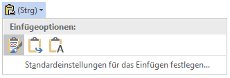
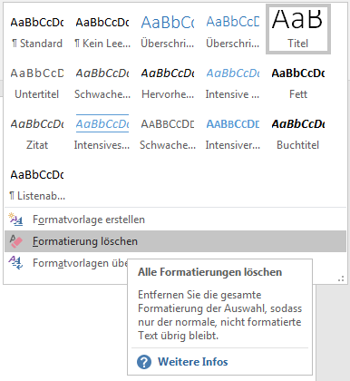

# Text säubern

Oft übernimmt möchte Text aus einer anderen Quelle übernehmen (z.B. von einer Webseite oder aus einem PDF-Dokument). Wie kann man verhindern, dass ungewollte Formatierungen mitkopiert werden?

## Variante 1
Dies ist die einfachste und von uns empfohlene Variante. Beim Einfügen des Textes erscheint ein Icon. Dort kann man das dritte Symbol «nur den Text übernehmen» auswählen.

## Variante 2
Besteht bereits ein Textverarbeitungsdokument mit einer Gestaltung, die man entfernen möchte, so kann man den Text auch direkt in Word säubern. Dazu markiert man den zu säubernden Teil und wählt dann im Formatvorlagen-Fenster den Eintrag «Formatierungen entfernen»

Allerdings wird hierbei nicht so umfassend gesäubert wie bei der ersten Variante: Links beispielsweise bleiben erhalten.

## Variante 3
Den Text zuerst in einen Text-Editor (z.B. Notepad) kopieren. Da der Text-Editor nicht mit Formatierungen umgehen kann, wird nur Text kopiert. Der gesäuberte Text kann nun markiert [[Ctrl]]+[[A]] und kopiert [[Ctrl]]+[[C]] werden.

Beim anschliessenden Einfügen in Word mittels [[Ctrl]]+[[V]] wird so garantiert nur Text übernommen.

## Variante 4
Je nach Browser und Webseite lässt sich eine «Leseansicht» des Artikels aktivieren. Diese Leseansicht blendet einige Elemente der Webseite (wie z.B. Navigationsmenus und Hintergrundgrafiken) aus, damit man sich auf den Inhalt konzentrieren kann. Dies hat auch Vorteile beim Drucken eines Artikel oder eben beim Kopieren des Inhaltes.

## Speziell zu beachten

Silbentrennung
: beim Kopieren (vor allem aus PDF-Dateien) können Trennstriche der Silbentrennung mitkopiert werden. Diese müssen von Hand entfernt werden.

Spezielle Zeichen
: Gerade in PDF-Dokumenten findet man oft Ligaturen (z.B. &#xFB01; statt fi oder &#xFB00; statt ff). Zudem werden Umlaute teilweise zusammengesetzt aus zwei Zeichen (z.B. a&#x0308; statt ä). Dies führt dazu, dass normale Umlaute, resp. Buchstaben-Zusammensetzungen, ohne Ligaturen anders aussehen als der kopierte Text.
