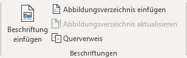
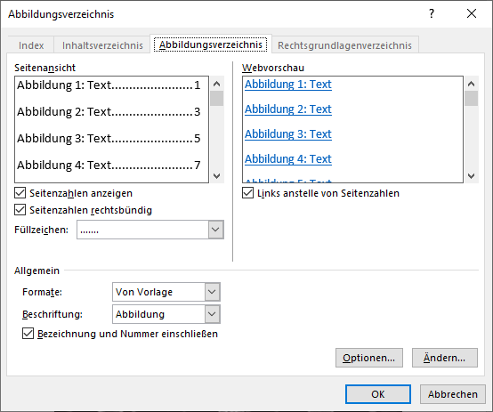

---
apps:
  - Microsoft Word
sidebar_position: 3
sidebar_custom_props:
  icon: mdi-image-multiple
  source: gym-kirchenfeld
  path: /docs/textverarbeitung/word-3/abbildungsverzeichnis/README.md
draft: true
---

# Abbildungsverzeichnis

## Voraussetzungen

Voraussetzung ist, dass die Abbildungen mit einer **Beschriftung** versehen worden sind.

Siehe [Beschriftungen](../../word-1/beschriftungen/)

## Abbildungsverzeichnis erstellen

Um ein Abbildungsverzeichnis zu erstellen, wähle den Menüpunkt __Referenzen__ :mdi-chevron-right: __Abbildungsverzeichnis&nbsp;einfügen__.

Anschliessend wird das folgende Fenster angezeigt. Hier kannst du einfach auf __OK__ klicken:

