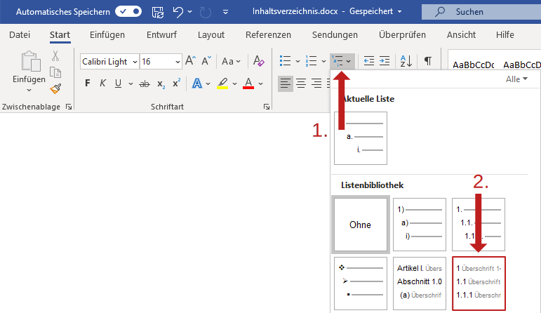
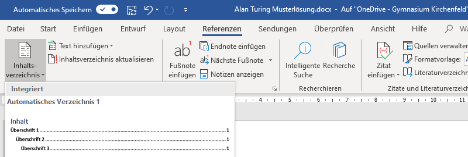
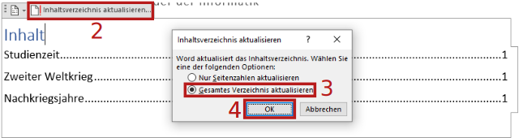

# Inhaltsverzeichnis

In Word gibt es Listen mit mehreren Ebenen, welche mit den _Überschrift_-Formatvorlagen verknüpft sind. Damit für die Überschriften automatisch eine hierarchische Nummerierung erstellt werden.

## Voraussetzung

Voraussetzung ist, dass allen Überschriften im Dokument eine _Überschrift_-Formatvorlage zugewiesen wird.

Siehe [Formatvorlagen zuweisen](../../word-1/formatvorlagen-zuweisen/)

## Hierarchische Nummerierung

Gehe so vor, um den Überschriften eine hierarchische Nummerierung zuzuordnen:

1. Klicke auf das Icon für die _Liste mit mehreren Ebenen_.
2. Wähle die angegebene Variante aus:

Wichtig ist, dass eine Nummerierungsvariante gewählt wird, welche in der Vorschau das Wort _Überschrift_ in grau enthält. Nur diese Varianten sind mit den _Überschrift_-Formatvorlagen verknüpft.

## Inhaltsverzeichnis einfügen

Um in Microsoft Word ein Inhaltsverzeichnis einzufügen, wird der Menüpunkt _Referenzen ‣ Inhaltsverzeichnis_ verwendet:

Es stehen verschiedene Layouts zur Auswahl. Im Zweifelsfall wird das oberste Layout gewählt.

Im Inhaltsverzeichnis erscheinen automatisch alle Überschriften, also alle Absätze, welchen eine «Überschrift»-Formatvorlage zugewiesen wurde.

## Inhaltsverzeichnis aktualisieren

Das Inhaltsverzeichnis wird nicht automatisch aktualisiert, wenn neue Überschriften eingefügt werden oder die Seitenzahlen sich ändern. Gehe so vor, um das Inhaltsverzeichnis zu aktualisieren:

1. Klicke das Inhaltsverzeichnis an.
2. Klicke auf __Inhaltsverzeichnis aktualisieren…__.
3. Wähle _Gesamtes Verzeichnis aktualisieren_ aus.
4. Klicke auf __OK__.

