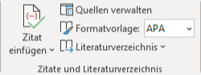
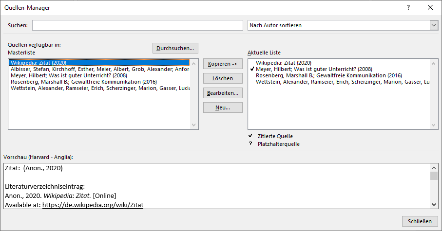
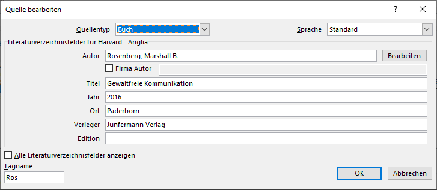
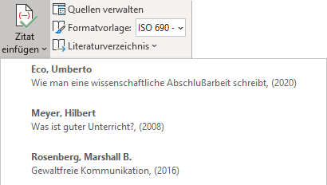
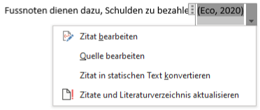
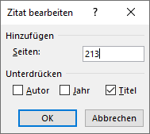
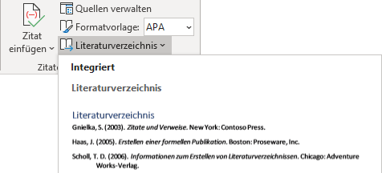
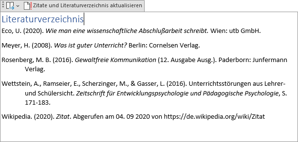

Microsoft Word hat eine Literaturverwaltung, mit welcher das Verwalten von Quellen, das Einfügen von Quellenvereisen und das Erstellen eines Literaturverzeichnisses stark vereinfacht werden.

Um ein Dokument mit Quellenangaben und einem Literaturverzeichnis zu versehen, sind folgende vier Schritte nötig:

1. Zitierstil wählen
2. Quellen erfassen
3. Quellenangaben einfügen
4. Literaturverzeichnis erstellen

## Menübereich Zitate

Die Literaturverwaltung findet sich im Menü __Referenzen__ im Menübereich _Zitate und Literaturverzeichnis_.

## 1. Zitierstil wählen

Der Zitierstil wird Menübereich _Zitate und Literaturverzeichnis_ bei _Formatvorlage_ ausgewählt. Im Kapitel [Zitierstile](../zitierstile/) wird erklärt, wie die Zitierstile unserer Schule installiert werden können. Wenn diese installiert sind, kann einer der folgenden Stile gewählt werden: 

- **GK Harvard** für die Autor-Jahr-Methode,
- **GK Vancouver** für die Referenzmethode.

## 2. Quellen erfassen

Quellen werden mit dem Quellenmanager verwaltet. Dieser wird mit der Schaltfläche __Quellen&nbsp;verwalten__ im Menübereich _Zitate und Literaturverzeichnis_ geöffnet:

Der Quellen-Manager enthält zwei Listen. **Links** werden alle Quellen aus der *Masterliste* angezeigt.  **Rechts** werden die Quellen im aktuellen Dokument angezeigt.

Klicke auf __Neu…__, um eine neue Quelle zu erfassen. Im folgenden Fenster werden die Angaben zur Quelle eingegeben:

### Quellentyp

Wähle zunächste den _Quellentyp_ aus. Normalerweise ist dies einer der folgenden Typen:

- Buch
- Zeitungsartikel
- Artikel in einer Zeitschrift
- Webseite

### Autorinnen und Autoren

Im Feld _Autor_ werden die Autorinnen und Autoren angegeben. Dabei wird zuerst immer der Nachname, gefolgt von einem Komma und den Vornamen angegeben. Wenn es mehrere Autorinnen oder Autoren gibt, werden diese durch ein Strichpunkt getrennt.

`Wettstein, Alexander; Ramseier, Erich; Scherzinger, Marion; Gasser, Luciano`

Wenn du unsicher bist, kannst du hinten am Feld auf __Bearbeiten__ klicken und die Namen einzeln erfassen.

### Weitere Felder

Je nach Quellentyp müssen weitere Felder erfasst werden. Unter [Quellen erfassen](../quellen-erfassen/) wird für typische Quellentypen erklärt, welche Daten in welchen Feldern erfasst werden müssen.

## 3. Quellenangaben einfügen

:::warning Hinweis
In Word werden Quellenangaben fälschlicherweise als «Zitate» bezeichnet.
:::

Klicke im Menübereich _Zitate und Literaturverzeichnis_ auf __Zitat einfügen__, um eine **Quellenangabe** einzufügen. Wähle aus der Liste die Quelle aus, auf welche du verweisen möchtest.

Klicke anschliessend auf die eingefügte Quellenangabe und öffne mit einem Klick auf __:mdi-menu-down:__ das Menü. Wähle den Menüeintrag __Zitat bearbeiten__:

Im folgenden Fenster kannst du die Seitenzahl für die Quellenangabe eingeben. Ausserdem kannst du  _Autor_, _Jahr_ und _Titel_ in der Quellenangabe unterdrücken:

Der Titel sollte immer unterdrückt werden. Autor und Jahr können unterdrückt werden, um folgende Zitierarten zu ermöglichen:

> Gemäss Eco haben Fussnoten auch den Zweck, die Herkunft der Zitate anzugeben (2020, S. 210). Sie können auch Richtigstellungen beinhalten (S. 211)

Um eine Quellenangabe zu löschen, klicke auf __:mdi-dots-vertical:__ und drücke anschliessend die Löschtaste.

## 4. Literaturverzeichnis erstellen

Klicke im Menübereich _Zitate und Literaturverzeichnis_ auf __Literaturverzeichnis__, um das Literaturverzeichnis einzufügen. Wähle das erste vorgeschlagene Verzeichnis aus.

Das Literaturverzeichnis kannst du jederzeit aktualisieren, indem du es anklickst und anschliessend aus __Zitate&nbsp;und&nbsp;Literaturverzeichnis&nbsp;aktualisieren__ klickst.

Um das Literaturverzeichnis zu löschen, klicke auf __:mdi-dots-vertical:__ und drücke anschliessend die Löschtaste.
