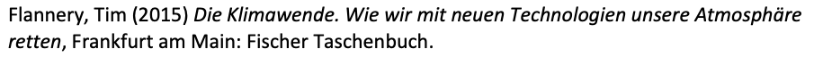
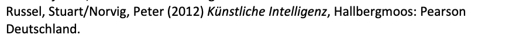
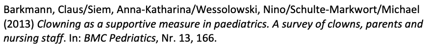
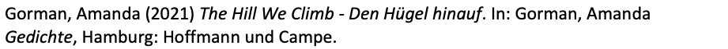

Hier wird für typische Quellen erklärt, wie diese in der Literaturverwaltung von Word erfasst werden können.

## Selbständig erschienene Quellen

### Einzelne/r Autor/in

| Feld       | Beispiel                                                                 |
| :--------- | :----------------------------------------------------------------------- |
| Quellentyp | **Buch**                                                                 |
| Autor      | Flannery, Tim                                                            |
| Titel      | Die Klimawende. Wie wir mit neuen Technologien unsere Atmosphäre retten. |
| Ort        | Frankfurt am Main                                                        |
| Verlag     | Fischer Taschenbuch                                                      |
| Jahr       | 2015                                                                     |

### Mehrere Autor*innen

| Feld       | Beispiel                                    |
| :--------- | ------------------------------------------- |
| Quellentyp | **Buch**                                    |
| Autor      | Russel, Stuart; Norvig, Peter               |
| Titel      | Künstliche Intelligenz. Ein moderner Ansatz |
| Ort        | Hallbergmoos                                |
| Verlag     | Pearson Deutschland                         |
| Jahr       | 2012                                        |

## Unselbständig erschienene Quellen

### Artikel in einem Magazin (Journal)

| Feld                  | Beispiel                                                                                       |
| :-------------------- | :--------------------------------------------------------------------------------------------- |
| Quellentyp            | **Artikel in einem Magazin**                                                                   |
| Autor                 | Barkmann, Claus; Siem, Anna-Katharina; Wessolowski, Nino; Schulte-Markwort; Michael            |
| Titel                 | Clowning as a supportive measure in paediatrics. A survey of clowns, parents and nursing staff |
| Titel der Zeitschrift | BMC Pediatrics                                                                                 |
| Jahr                  | 2013                                                                                           |
| Ausgabe               | 13                                                                                             |
| Seiten                | 166                                                                                            |

### Text in einem Sammelband

| Feld       | Beispiel                             |
| :--------- | :----------------------------------- |
| Quellentyp | **Buchabschnitt**                    |
| Autor      | Gorman, Amanda                       |
| Titel      | The Hill We Climb - Den Hügel hinauf |
| Buchautor  | Gorman, Amanda                       |
| Buchtitel  | Gedichte                             |
| Ort        | Hamburg                              |
| Verlag     | Hoffmann und Campe                   |
| Jahr       | 2021                                 |

## Webseiten

### Wikipedia-Artikel

Der Wikipedia-Artikel zu «Zitat» wird folgendermassen erfasst:

:::warning Achtung
Im Feld «Website» wird der Name des Web-Auftritts erfasst, also «Wikipedia». Im Feld «Webseite» wird der Title des konkreten Artikels erfasst, also «Zitat».

Da jeder Wikipediaartikel von einer Vielzahl von Autorinnen und Autoren bearbeitet wurde, geben wir im Feld Autor «Wikipedia» an.
:::

| Feld               | Inhalt                | Beispiel                            |
| :----------------- | :-------------------- | :---------------------------------- |
| Quellentyp         | Webseite              |                                     |
| Autor              | «Wikipedia»           | Wikipedia                           |
| Name der Webseite  | Name des Artikels     | Zitat                               |
| Name der Website   | «Wikipedia»           | Wikipedia                           |
| URL                | Link auf die Webseite | https://de.wikipedia.org/wiki/Zitat |
| Jahr               | aktuelles Jahr        | 2021                                |
| Jahr des Zugriffs  |                       | 2021                                |
| Monat des Zugriffs |                       | 5                                   |
| Tag des Zugriffs   |                       | 17                                  |
