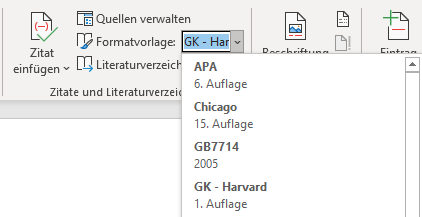
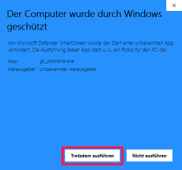
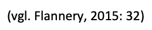

# Zitierstile

Die offiziellen Zitierstile unserer Schule werden in «[Korrektes Zitieren und Bibliographieren](/downloads/korrektes-zitieren.pdf)» erklärt. Je nach Fachrichtung wird die Harvard-Zitation oder die Vancouvermethode eingesetzt.

## Zitierstile in Word

In Word kann der Zitierstil im Menü __Referenzen__ im Menübereich _Zitate und Literaturverzeichnis_ unter _Formatvorlage_ ausgewählt werden. Word bietet einige vordefinierte Zitierstile, welche jedoch nicht unseren offiziellen Stilen entsprechen.

## Zitierstile installieren

:::warning Wichtig
Diese Installationsanleitung gilt nur für **Microsoft 365**, nicht für ältere Word-Versionen.

Nach der Installation muss Word unbedingt neu gestartet werden, damit die neuen Zitierstile erkannt werden.
:::

### Windows

Mit dem folgenden Installationsprogramm können die offiziellen Zitierstile des Gymnasiums Kirchenfeld installiert werden:

[:mdi-download: gk_zitierstile.exe](/downloads/gk_zitierstile.exe)

Es kann sein, dass folgende Meldung angezeigt wird:

Hier muss auf den Link __Weitere Informationen__ geklickt werden. Anschliessend muss auf den Knopf __Trotzdem ausführen__ geklickt werden:

Nachdem Word neu gestartet wurde, können im Menü __Referenzen__ im Menübereich _Zitate und Literaturverzeichnis_ unter _Formatvorlage_ die GK-Zitierstile ausgewählt werden.

### macOS

Lade die Zitierstile herunter:

[:mdi-download: GK_Harvard.xsl](/downloads/GK_Harvard.xsl)

[:mdi-download: GK_Vancouver.xsl](/downloads/GK_Vancouver.xsl)

Nun musst du die Dateien in einen Unterordner der Word-App kopieren.

1. Gehe im Finder zu den _Programmen_.
2. Klicke mit der rechten Maustaste auf die Word-App und wähle den Menüpunkt _Paketinhalt zeigen_.

    

3. Öffne in der Word-App den Unterordner _Contents / Resources / Style_.
4. Verschiebe die heruntergeladenen Dateien in diesen Ordner.

## Zitierstil «GK - Harvard»

Der Zitierstil _GK - Harvard_ stellt Quellenverweise nach dem Autor-Jahr-Methode dar.

### Quellenverweise

Im Gegensatz zu den vordefinierten Zitierstilen werden bei diesem Stil Quellenverweise ohne Klammern dargestellt:

Das hat den Vorteil, dass Quellenangaben in Fussnoten oder Bildbeschriftungen verwendet werden können:

Bei einem Quellenverweis im Fliesstext müssen die Klammern von Hand gesetzt werden. Dabei können auch zusätzliche Vermerke hinzugefügt werden:

Seitennummern werden gemäss Richtlinien mit einem Doppelpunkt vom Publikationsjahr abgetrennt.

### Literaturverzeichnis

Das Literaturverzeichnis im Harvard-Stil sieht folgendermassen aus:

## Zitierstil «GK - Vancouver»

Der Zitierstil _GK - Vancouver_ stellt Quellenverweise nach dem Referenznummernsystem dar.

### Quellenverweise

Quellenverweise werden als Nummer in eckigen Klammern dargestellt.

### Literaturverzeichnis

Das Literaturverzeichnis im Vancouver-Stil sieht folgendermassen aus:

