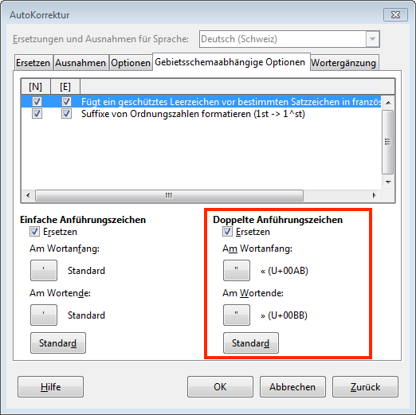

Bei *LibreOffice Writer* kann das gewünschte Anführungszeichen ausgewählt werden. Dieses ersetzt während des Tippens das «gerade» Anführungszeichen ". Dazu wählst du im Menu __Extras__ :mdi-chevron-right: __AutoKorrektur Optionen__ :mdi-chevron-right: __Gebietsschemaabhängige Optionen__ und gibst an, wie die einfachen, resp. doppelten Anführungszeichen ersetzt werden sollen. Standardmässig werden sie mit deutschen Anführungszeichen ersetzt. Tippt man "...", wird daraus automatisch „...“. Möchtest du stattdessen die französischen Guillemets verwenden, also «...» erhalten, so kannst du dies durch folgende Einstellung erreichen:

