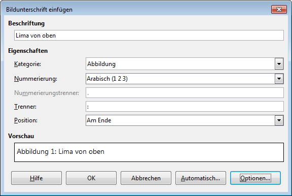
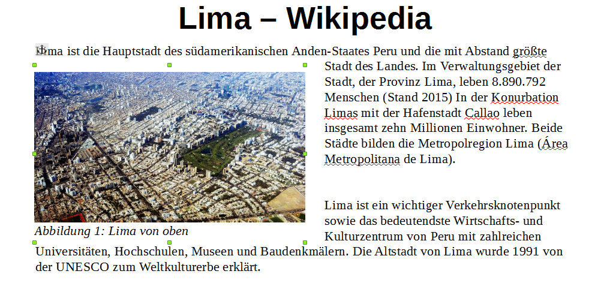

# Beschriftungen einfügen

## Beschriftung einfügen

Du wählst das Bild aus, dann machst du entweder einen Rechtsklick darauf und wählst __Beschriftung einfügen…__ oder du gehst über das Menu __Einfügen__ :mdi-chevron-right: __Beschriftung…__. Bei Tabellen funktioniert nur der Weg über das Menu. Das folgende Fenster erscheint:

Je nach gewähltem Objekt (also Bild oder Tabelle) wird automatisch die Kategorie gewählt. Im ersten Feld musst du einen Text für die Beschriftung eingeben. Zusätzlich kannst du unter __Position__ wählen, ob die Beschriftung ober- oder unterhalb des Objektes eingefügt werden soll.

## Beschriftetes Objekt verwalten

LibreOffice gruppiert das Bild und die Beschriftung automatisch in einem Rahmen. Du kannst den Textfluss, den Abstand zum Text sowie auch Grösse und Position wie gewohnt verändern. Dabei gilt es aber zu beachten, dass du den Rahmen um Bild und Beschriftung wählst und nicht nur das Bild selbst.

Um die Beschriftung selbst zu ändern, kannst du direkt in die Beschriftungszeile klicken und Änderungen anbringen. Hier kannst du auch die Ausrichtung der Beschriftung ändern. Wenn du aber alle Beschriftungen im Dokument anpassen möchtest, dann solltest du besser die Formatvorlage «Abbildung» anpassen. Sie wird allen Beschriftungen beim Einfügen zugewiesen.
