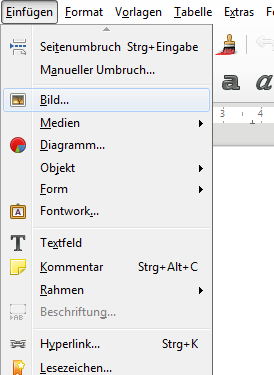
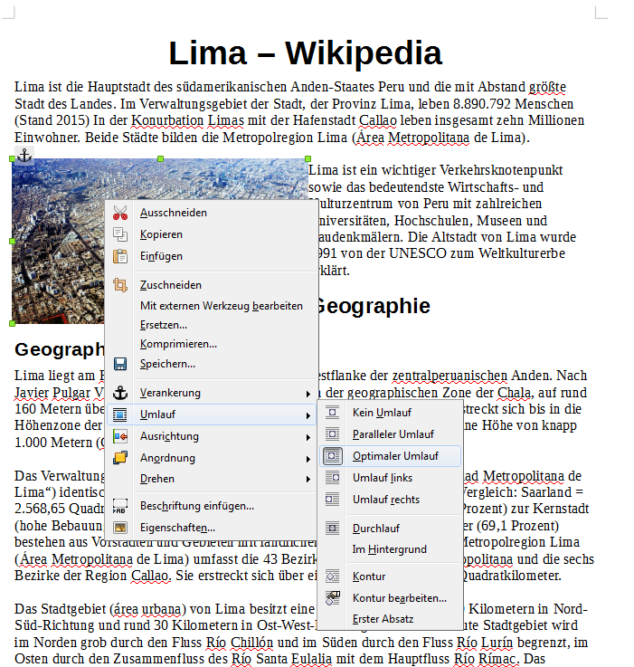
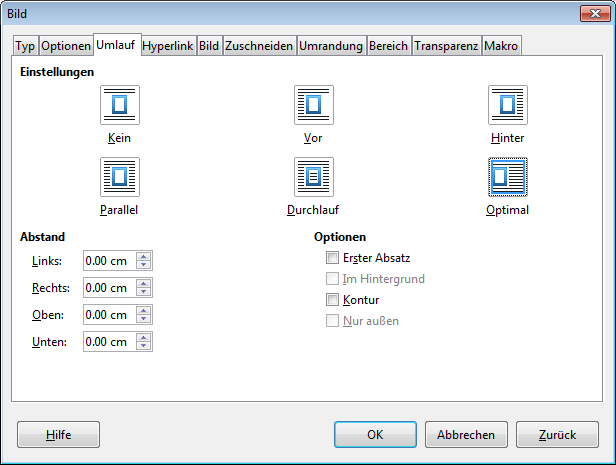

# Bilder einfügen und positionieren

## Bilder einfügen
Bilder können über die Zwischenablage mit [[Ctrl]] + [[V_]] oder über __Einfügen__ :mdi[chevronRight] __Bild…__ als Datei eingefügt werden.

## Textfluss festlegen
Ein Rechtsklick auf das Bild und __Umlauf__ :mdi[chevronRight] __Textumbruch__ erlaubt es dir, verschiedene Positionierungen zu wählen:

Ein Rechtsklick und __Eigenschaften__ :mdi[chevronRight] Tab _Umlauf_ öffnet das Layout-Fenster mit den Detaileinstellungen:

---

Siehe auch: Tipp [Beschriftungen einfügen](../beschriftungen-einfuegen)
