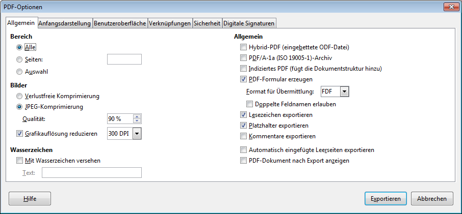

# Endprodukt als PDF

## Wieso?
Einen mit einer Textverarbeitung geschriebenen Text liefert man entweder in Papierform oder als PDF-Datei ab. Die Original-Dokumente werden nur verschickt, wenn der Empfänger sie weiterbearbeiten muss!

Der grosse Vorteil dabei: PDF-Dokumente können auf allen Systemen dargestellt werden (Windows, Linux, macOS, Smartphone, Web). D.h. der Empfänger muss kein Microsoft Office oder LibreOffice installiert haben, um den Text zu lesen.

## Wie?
Du wählst __Datei__ :mdi-chevron-right: __Als PDF exportieren…__. Im folgenden Dialog kannst du zahlreiche Einstellungen wählen. Wenn die Datei z.B. zu gross für den E-Mail-Versand wird, kannst du bei JPEG-Komprimierung die Qualität herunterschrauben oder darunter die Grafikauflösung reduzieren. Viele weitere Einstellungen sind mölgich.

