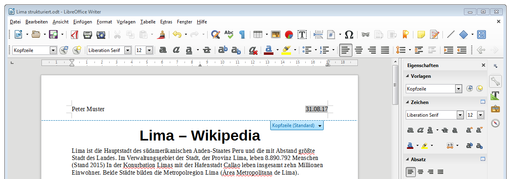
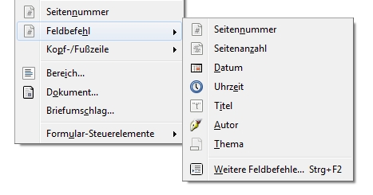
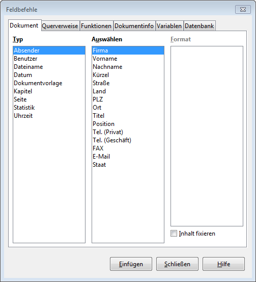

Jedes Dokument besitzt grundsätzlich eine Kopf- und eine Fusszeile. Normalerweise sind diese – bis auf die Tabstopps in der Mitte und rechts – leer.

## Kopf- und Fusszeile editieren
Durch einen Doppelklick auf den Bereich der Kopf- oder Fusszeile (also im obersten oder untersten Bereich einer Seite) wird diese zur Bearbeitung geöffnet:

## Felder einfügen
Felder können über das Menu __Einfügen__ :mdi-chevron-right: __Feldbefehl__ eingefügt werden.

Eine Übersicht über alle verfügbaren Felder erhält man auch dort unter __Weitere Feldbefehle…__ oder [[Ctrl]] + [[F2]]

Teilweise gibt es Optionen und Formate, z.B. bei Daten kann das Datumsformat gewählt werden.

## Felder verwalten
Felder werden grau hinterlegt dargestellt. Mit einem Rechtsklick und __Feldbefehl…__ kann man das Feld oder sein Format **anpassen**. Felder **aktualisieren** kann man  über [[F9]] oder __Extras__ :mdi-chevron-right: __Aktualisieren__ :mdi-chevron-right: __Felder__.
