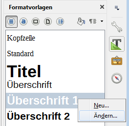
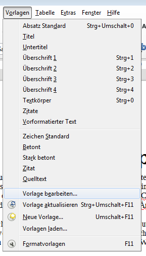
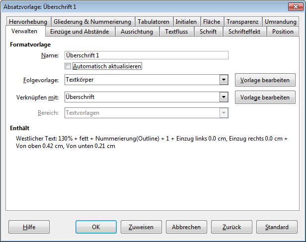

# Formatvorlagen anpassen

:::tip
Vor dem Gestalten eines Dokumentes durch Anpassen der Formatvorlagen solltest du sicherstellen, dass dein Dokument keine Direktformatierungen enthält. Sonst können die Formatvorlagen nicht korrekt angewandt werden.
Falls du noch Direktformatierungen hast, dann empfiehlt es sich, den Text zuerst zu säubern (siehe Tipp [Text säubern](../text-saeubern)) und dann erst die Formatvorlagen zuzuweisen (siehe Tipp [Formatvorlagen zuweisen](../formatvorlagen-zuweisen)).
:::

## Formatvorlagen ändern

Mache einen Rechtsklick auf die zu ändernde Formatvorlage im Formatvorlagenfenster und wähle __Ändern…__

oder platziere den Cursor im Text bei der zu ändernden Formatvorlage und wähle im Menu __Vorlagen__ :mdi[chevronRight] __Vorlage bearbeiten…__

## Einstellungen Formatvorlage

Sämtliche Einstellungen der gewählten Formatvorlage kannst du im folgenden Fenster vornehmen:

Die Einstellungen findest du gruppiert nach Thema in den Tabs: _Einzüge und Abstände_, _Ausrichtung_, …
