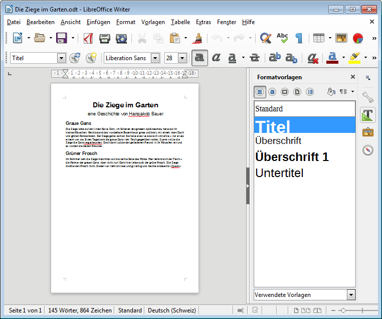

# Formatvorlagen zuweisen

:::warning
Eventuell empfiehlt es sich, den Text zuerst zu säubern (siehe Tipp [Text säubern](../text-saeubern/)).
:::

Formatvorlagen können sehr einfach zugewiesen werden:

* Zuerst markierst du den Text, dem du eine Formatvorlage zuweisen möchtest.
* Dann klickst du auf die entsprechende Formatvorlage.

Für die Auswahl der Formatvorlage stehen drei Möglichkeiten zur Verfügung:

## Formatvorlagen-Fenster in Seitenleiste
Durch einen Klick auf das __T__ in der Seitenleiste, über das Menu unter __Vorlagen__ :mdi-chevron-right: __Formatvorlagen__ oder mittels Tastenkürzel [[F11]] öffnest du das Formatvorlagen-Fenster.

Hier siehst du gleich eine Vorschau der Formatierung und kannst im Dropdown unten an der Seitenleiste zusätzlich festlegen, welche Vorlagen angezeigt werden.

## Dropdown in Symbolleiste «Formatierungen»
Das erste Dropdown in der zweiten Symbolleiste (siehe Screenshot oben) zeigt die Formatvorlage des aktuell gewählten Absatzes an (hier «Titel»). Wählt man eine andere Vorlage, wird diese für den aktuell markierten Absatz übernommen.

## Menu
Das Menu __Vorlagen__ bietet raschen Zugriff auf die häufigsten Formatvorlagen. Ein Klick auf eine Formatvorlage im Menu weist diese dem aktuellen Absatz zu.
