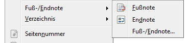
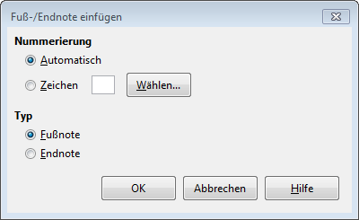

---
tags:
  - Fussnoten
  - Endnoten
apps:
  - LibreOffice Writer
sidebar_position: 10
sidebar_custom_props:
  icon: mdi-foot-print
  source: gym-kirchenfeld
  path: /docs/textverarbeitung/writer/fussnoten-einfuegen/README.md
draft: true
---

# Fussnoten einfügen

Fussnoten dienen dazu, Erklärungen zu einem Begriff im Text zu liefern, ohne dabei beim Lesen des eigentlichen Textes zu stören. Die Erklärung wird nicht direkt im Satz dargestellt, sondern unten an der Seite oder am Ende des Dokuments. Eine kleine, hochgestellte Zahl direkt hinter dem entsprechenden Begriff weist den/die Leser*in auf die Existenz einer entsprechenden Erklärung hin.

Wie kann ich Anmerkungen in einem Dokument in Form von Fussnoten hinzufügen?

Fussnoten können über das Menu __Einfügen__ :mdi[chevronRight] __Fuss-/Endnote__ eingefügt werden. **Fussnoten** werden am Seitenende dargestellt, während **Endnoten** gesammelt am Ende des Dokumentes aufgeführt werden.

Der dritte Menupunkt __Fuss-/Endnote…__ öffnet ein Fenster mit zusätzlichen Einstellungsmöglichkeiten:

