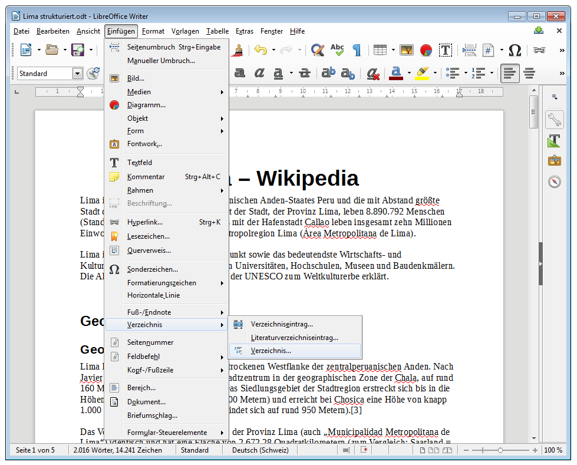

Hast du ein Dokument mit mehreren Überschriften, so kannst du daraus automatisch ein Inhaltsverzeichnis generieren lassen.

Am besten setzt du den Cursor an die Stelle, wo das Verzeichnis eingefügt werden soll, und wählst dann __Einfügen__ :mdi-chevron-right: __Verzeichis__ :mdi-chevron-right: __Verzeichnis…__ aus.

Im darauf erscheinenden Dialog kannst du weitere Einstellungen vornehmen. Aber auch ohne etwas zu verstellen wird beim Klick auf __OK__ ein Verzeichnis eingefügt.

Writer verwendet standardmässig für die Erkennung der einzelnen Kapitel die Formatvorlagen «Überschrift 1-10». Die Kapitel müssen also mit einer Absatzvorlage vom Typ «Überschrift» eingeleitet werden. Writer übernimmt dann automatisch den Inhalt der Überschrift ins Inhaltsverzeichnis und fügt die Seitennummer hinzu.
