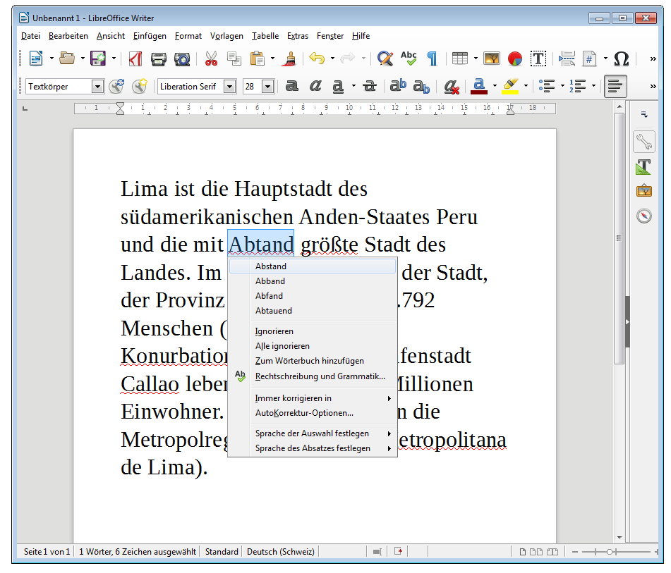
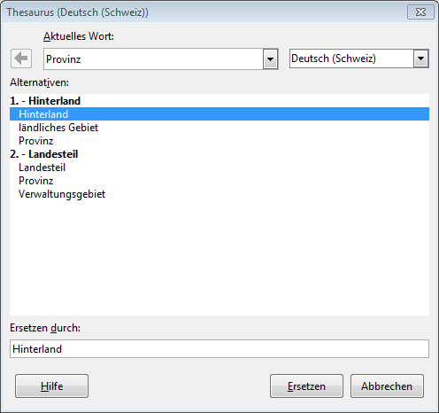

# Rechtschreibekorrektur

Welche Hilfe bietet mir mein Programm bei Grammatik und Rechtschreibung? Wo sind Grenzen?

## Rechtschreibekorrektur

Wenn du von der Rechtschreibeprüfung von *LibreOffice* profitieren möchtest, musst du als erstes sicherstellen, dass im Dokument die korrekte Sprache eingestellt ist. Das erkennst du im Writer-Fenster unten in der Mitte, wo im Screenshot «Deutsch (Schweiz)» steht:

Alle Wörter, die *LibreOffice* als falsch geschrieben interpretiert, werden rot gewellt unterstrichen.

* «Abtand» ist ja wirklich falsch. Mit einem Rechtsklick darauf gibt dir *LibreOffice* Vorschläge, um das Wort zu korrigieren. Im Beispiel kannst du also «Abstand» auswählen und der Fehler wird korrigiert.
* Das Wort «Konurbation» kennt *LibreOffice* nicht. Hier könntest du auf __Ignorieren__ oder __Alle ignorieren__ klicken, damit das Wort nicht mehr als Fehler markiert wird. Möchtest du das Wort auch in anderen Dokumenten verwenden, dann wählst du __Zum Wörterbuch hinzufügen__. Somit wird das Wort in deine persönliche Wörterliste aufgenommen und wird nun nie mehr als falsch geschrieben gekennzeichnet.
* «Área Metropolitana» wird natürlich als falsch erkannt, weil es nicht deutsche Wörter sind. Entweder stellst du die Sprache für die beiden Wörter auf Spanisch, oder du ignorierst die Rechtschreibeprüfung für sie.

## Thesaurus
Neben der Rechtschreibung bietet *LibreOffice* unter __Extras__ :mdi-chevron-right: __Thesaurus__ einen Thesaurus an. Dieser schlägt Synonyme für Wörter vor, welche wie Rechtschreibekorrekturen einfach übernommen werden können.

## Grammatik
In *LibreOffice* kannst du eine Grammatikprüfung als Plugin nachinstallieren, z.B. [LanguageTool](https://www.languagetool.org/de/).
