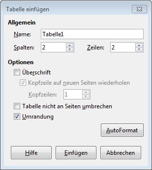
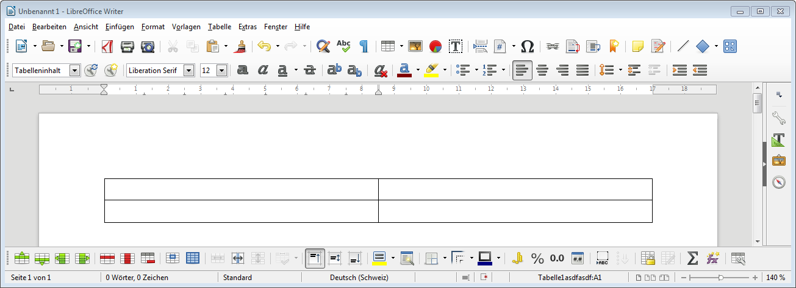

## Tabellen einfügen
Im Menu wählst du __Tabelle__ :mdi-chevron-right: __Tabelle einfügen…__, dann gibst du Anzahl der Spalten und Zeilen an. Zusätzlich kannst du wählen, ob die Tabelle eine Überschrift und eine Umrandung haben soll.

## Tabelle editieren
Wenn man ein Tabelle anwählt, erscheint im unteren Bereich des Fenster eine zusätzliche Symbolleiste. Hier können **Zeilen oder Spalten hinzugefügt** (grüne Icons) oder **gelöscht** (rote Icons) werden. Zudem lassen sich **Zellen trennen** oder **verbinden**.

## Tabelle formatieren
Die oben beschriebene Symbolleiste lässt auch Anpassungen für die Textausrichtung, Hintergrundfarbe sowie Rahmeneinstellungen und Zellenformate zu.

---

Siehe auch: [Beschriftungen einfügen](../beschriftungen-einfuegen)
