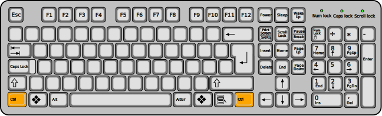
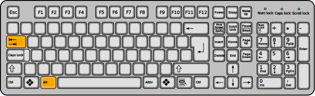
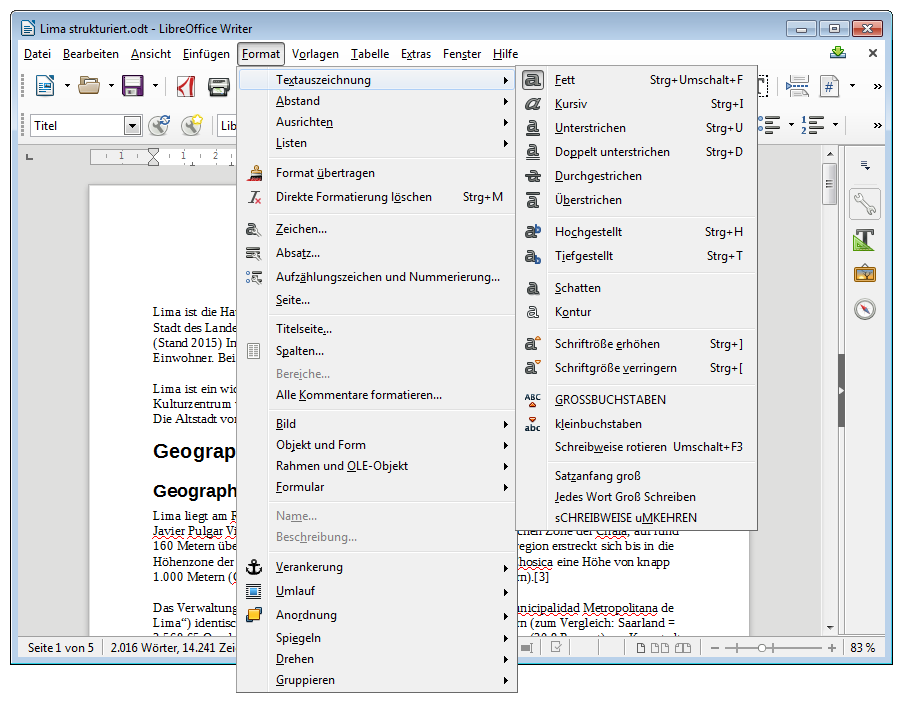

---
apps:
  - LibreOffice Writer
sidebar_position: 12
sidebar_custom_props:
  icon: mdi-keyboard
  source: gym-kirchenfeld
  path: /docs/textverarbeitung/writer/tastenkuerzel/README.md
draft: true
---

# Tastaturkürzel

Eine Übersicht einiger praktischer Tastaturkürzel

:::warning
Die Control-Taste wird im Deutschen «Steuerung» genannt. Während die deutsche Version von Word bei Tastaturkürzeln [[Strg]] anzeigt, verwenden wir den Namen, der auf Schweizer Tastaturen angezeigt wird, und schreiben [[Ctrl]]. Gemeint ist dieselbe Taste!
Ähnliches gilt für die [[Shift]]-Taste: diese wird im deutschen als «Umschalt» bezeichnet.
:::

## Allgemeines
Diese Tastaturkürzel lassen sich auch in vielen anderen Anwendungen verwenden.

### Dateiaktionen

| Kürzel           | Aktion                       |
| ---------------- | ---------------------------- |
| [[Ctrl]] + [[N]] | Neues Dokument anlegen       |
| [[Ctrl]] + [[S]] | Aktuelles Dokument speichern |
| [[Ctrl]] + [[O]] | Anderes Dokument öffnen      |
| [[Ctrl]] + [[P]] | Aktuelles Dokument drucken   |

### Zwischenablage

| Kürzel           | Aktion                                                      |
| ---------------- | ----------------------------------------------------------- |
| [[Ctrl]] + [[A]] | Alles markieren                                             |
| [[Ctrl]] + [[C]] | Markierung in die Zwischenablage kopieren                   |
| [[Ctrl]] + [[X]] | Markierung ausschneiden (in die Zwischenablage verschieben) |
| [[Ctrl]] + [[V]] | Inhalt aus der Zwischenablage einfügen                      |

### Wechsel zwischen Fenstern
Oft wechselt man zwischen zwei oder mehr Programmfenstern hin und her, z.B. zwischen der Textverarbeitung und einem Browser-Fenster. Dabei verliert man sehr viel Zeit, wenn man zum Wechsel immer mit der Maus über die Taskleiste das Fenster wechselt. Viel schneller geht das mit [[Alt]] + [[Tab]]:

* Man drückt und hält die [[Alt]]-Taste.
* Jedes Drücken und Loslassen der [[Tab]]-Taste wechselt zum nächsten offenen Fenster.
* Lässt man die [[Alt]]-Taste los, wird das Programm-Wechseln beendet und das ausgewählte Fenster angezeigt.
* Hinweis: Drückt man zusätzlich zur [[Alt]]-Taste beim Wechseln die [[Shift]]-Taste, dann werden die Fenster rückwärts durchlaufen.

### Weitere Tastaturkürzel
Wenn du einen bestimmten Befehl immer wieder verwendest, lohnt es sich evtl., das zugehörige Tastaturkürzel zu lernen. Im Menu werden die zu den Befehlen gehörenden Tastaturkürzel angezeigt. So kannst du z.B. einen markierten Text fett formatieren mit [[Ctrl]] + [[Shift]] + [[F]].

### Tastaturkürzel selbst definieren
Falls für einen Befehl kein Tastaturkürzel definiert ist oder du ein bestehendes Kürzel anpassen möchtest, kannst du das unter __Extras__ :mdi[chevronRight] __Anpassen__ :mdi[chevronRight] __Tastatur__ erledigen.
