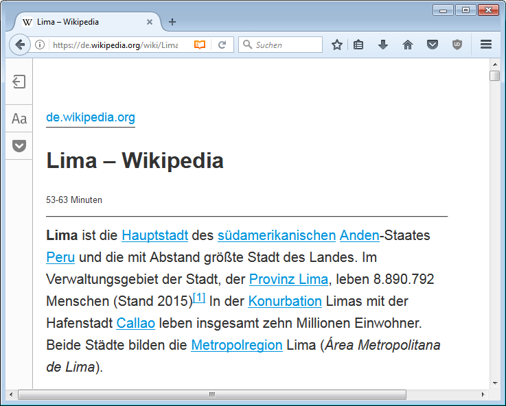

# Text säubern

Man möchte Text aus einem Dokument, z.B. einer Webseite oder einem PDF-Dokument übernehmen. Wie kann man verhindern, dass ungewollte Formatierungen mitkopiert werden?

## Variante 1
Den Text normal in die Zwischenablage kopieren und dann über das Menu __Bearbeiten__ :mdi-chevron-right: __Unformatierten Text einfügen__.
Dies funktioniert auch mit dem (zugegeben etwas komplizierten) Tastenkürzel [[Ctrl]] + [[Alt]] + [[Shift]] + [[V]].

## Variante 2
Es ist auch möglich, direkt im Programm den Text zu säubern. Dazu markiert man den zu säubernden Teil und wählt dann in der Symbolleiste «Formatierungen» beim Formatvorlagen-Dropdown den Eintrag «Formatierung löschen»

## Variante 3
Den Text zuerst in einen Text-Editor (z.B. Notepad) kopieren. Da der Text-Editor nicht mit Formatierungen umgehen kann, wird nur Text kopiert. Der gesäuberte Text kann nun markiert [[Ctrl]]+[[A]] und kopiert [[Ctrl]]+[[C]] werden.

Beim anschliessenden Einfügen in LibreOffice Writer [[Ctrl]]+[[V]] wird so garantiert nur Text übernommen.

## Variante 4
Je nach Browser und Webseite lässt sich eine «Leseansicht» des Artikels aktivieren. Diese Leseansicht blendet einige Dinge der Webseite, wie Navigationsmenus und Hintergrundgrafiken aus, damit man sich auf den Inhalt konzentrieren kann. Dies hat auch Vorteile beim Drucken eines Artikel oder eben beim Kopieren des Inhaltes.

## Speziell zu beachten

Silbentrennung
: beim Kopieren (vor allem bei PDF-Quellen) können Trennstriche der Silbentrennung mitkopiert werden. Diese müssen von Hand entfernt werden.

Spezielle Zeichen
: Gerade in PDF-Dokumenten findet man oft Ligaturen (z.B. [[&#xFB01;]] statt [[fi]] oder [[&#xFB00;]] statt [[ff]]). Zudem werden Umlaute teilweise zusammengesetzt aus zwei Zeichen (z.B. [[a &#x0308;]] statt [[ä]]). Dies führt dazu, dass normale Umlaute, resp. Buchstaben-Zusammensetzungen, ohne Ligaturen anders aussehen als der kopierte Text.
