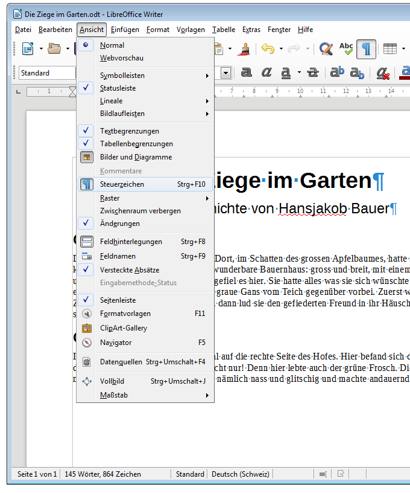

## Versteckte Zeichen anzeigen

Textdokumente enthalten sogenannte Formatierungszeichen. Diese werden nicht standardmässig nicht angezeigt und selbstverständlich auch nicht ausgedruckt, steuern aber den Textfluss. Man kann sich diese versteckten Zeichen zur besseren Orientierung anzeigen lassen: __Ansicht__ :mdi-chevron-right: __¶ Steuerzeichen__ oder [[Ctrl]] + [[F10]]

## Die wichtigsten versteckten Zeichen

Eine Auswahl an versteckten Zeichen, die nützlich sein können:

| Zeichen                 |                         Darstellung                          | Bemerkungen                                                                                                                                                                                                                                                   |
| ----------------------- | :----------------------------------------------------------: | ------------------------------------------------------------------------------------------------------------------------------------------------------------------------------------------------------------------------------------------------------------- |
| Leerschlag              |                    <code>&middot;</code>                     | In einem normalen Text sollte immer nur ein Leerschlag zwischen zwei Wörtern stehen. Zudem erkennst du, wenn ein Satz mit einem Leerschlag beginnt.                                                                                                           |
| geschützter Leerschlag  |             wie Leerschlag, aber grau hinterlegt             | Ein geschützter Leerschlag ist ein Leerschlag, bei dem die Zeile nicht umgebrochen werden darf. Du kannst ihn z.B. in Telefonnummern oder bei Massangaben wie «CHF&nbsp;10.–» oder «44&nbsp;g» verwenden, damit der Wert nicht von der Einheit getrennt wird. |
| Zeilenumbruch           |                     <code>&#8629;</code>                     | siehe Tipp [Absatzwechsel vs. Zeilenumbruch](../../allgemein/absatz-vs-zeilenwechsel)                                                                                                                                                                         |
| geschützter Bindestrich |            wie Bindestrich, aber grau hinterlegt             | Ein geschützter Bindestrich ist ein Bindestrich, nach dem kein Zeilenwechsel stattfinden darf.                                                                                                                                                                |
| weiches Trennzeichen    | wie Bindestrich, aber grau hinterlegt und ohne eigene Breite | Ein bedingter Trennstrich hilft der automatischen Silbentrennung, indem er die korrekte Stelle angibt, an welcher ein Wort getrennt werden darf. Du kannst ihn verwenden, falls die automatische Silbentrennung fehlschlägt.                                  |
| Tabulator               |                     <code>&#8594;</code>                     | Springt zum nächsten Tabstopp.                                                                                                                                                                                                                                |

## Versteckte Zeichen einfügen
Während normale Leerschläge und Tabulatoren mit den entsprechenden Tasten eingetippt werden, braucht es bei Zeilenumbrüchen bereits eine Tastenkombination, nämlich [[Shift]] + [[Return]]. Einige weitere Steuerzeichen können über das Menu __Einfügen__ :mdi-chevron-right: __Formatierungszeichen__ eingefügt werden. Natürlich existieren auch für diese Zeichen Tastenkombinationen.

