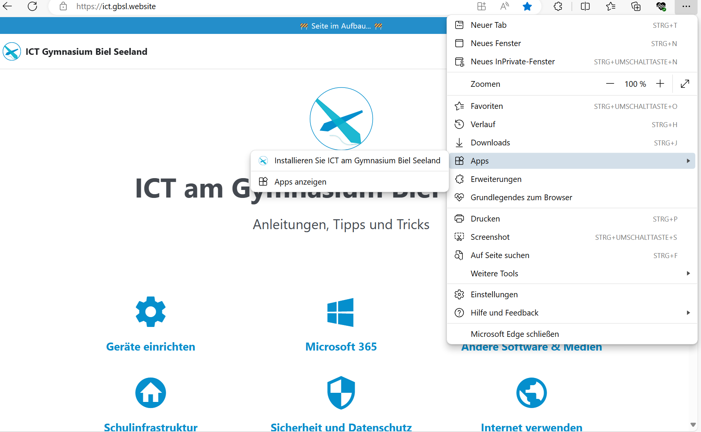
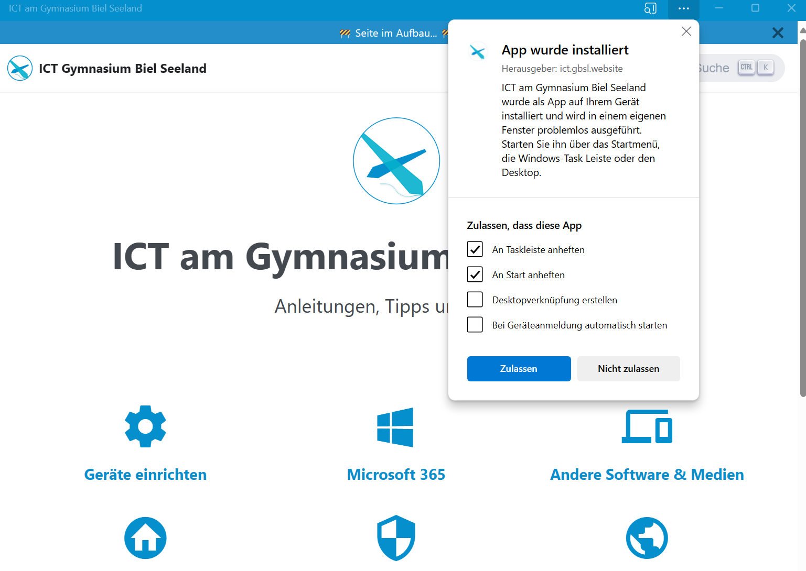

# Webseite als App installieren

**Eine vielbenötigte Website als App auf dem Startbildschirm oder auf der Taskleiste ablegen.**

:::details[Kontext: Störungsmeldung, ICT]
Für Lehrpersonen:
Vielleicht hast du im Unterricht keine Zeit gefunden, eine Störungsmeldung abzusenden, aber jetzt hättest du Zeit, es ist aber nirgends ein QR-Code-Kleber zu finden und wo man den Link für das Formular finden kann ist auch nicht ersichtlich. 

Im Browser kannst du natürlich einen Favoriten setzen für die Störungsmeldung. Noch einfacher ist es, die Website als «App» abzulegen auf dem Startbildschirm oder der Taskleiste deines Laptops und deines Smartphones.

Für Schüler:innen:
Du möchtest die ICT-Seite immer gleich zur Hand haben und sie bspw. auf dem Smartphone als "App" ablegen oder auf der Taskleiste deines Laptops abspeichern.
:::

## Anleitung

Beispiel 1: Link zur Störungsmeldung als App: 👉 https://forms.office.com/r/akUrVUFaRu (für Lehrpersonen)

Beispiel 2: Link zur ICT-Seite als App: 👉 https://ict.gbsl.website/ (für Schüler:innen)

Gilt für PC, Mac, iPad, iPhone, Android und Safari, Chrome und Edge: 3 Punkte rechts oben anklicken.

<BrowserWindow browser="edge" url="https://forms.office.com/r/akUrVUFaRu" >

### Windows und Edge

Symbol ändern.

Installationsort festlegen und installieren.

</BrowserWindow>

<BrowserWindow browser="edge" url="https://ict.gbsl.website" >

### Windows und Edge

Und hier ist es noch einfacher, das Icon für die App wird automatisch übernommen, anklicken und Installationsort festlegen und installieren.

</BrowserWindow>

