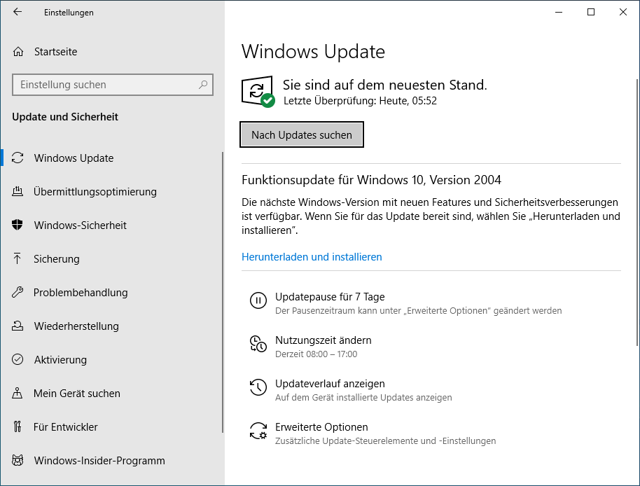

# Updates

Updates sind wichtig, damit deine Programme auf dem aktuellen Stand bleiben. Meist erhalten sie Verbesserungen von Fehlern und schliessen auch Sicherheitslöcher, dienen damit dem Schutz deines Gerätes und deiner Dateien.

<Tabs>
  <TabItem value="win" label="Windows">
    1. Öffne die Systemeinstellungen und wähle *Updates & Sicherheit*.
    2. Wähle links im Menü ganz oben den Menüpunkt __:mdi[autorenew] Windows Update__.
    3. Überprüfe, ob ein Funktionsupdate zur Installation bereit steht. Falls ja, klicke auf __Herunterladen und installieren__.

    

    ## Weitere Updates installieren

    1. Öffne die Systemeinstellungen und wähle *Updates & Sicherheit*.
    2. Wähle unten rechts *Erweiterte Optionen*.
    3. Wähle *Updates für andere Microsoft-Produkte erhalten*.
  </TabItem>

  <TabItem value="osx" label="Mac OS">
    Anleitung Mac OS
    Das Betriebssystem von MacBooks heisst macOS. Das Betriebssystem und wichtige Apps sollte unbedingt auf dem neuesten Stand gehalten werden, um die Sicherheit zu gewährleisten.

    ## Betriebssystem-Version überprüfen

    Öffne die Systemeinstellungen und wähle *Softwareupdate*. Überprüfe folgendes:

    - Es steht **«Dein Mac ist auf dem neuesten Stand»**.
    - Es ist eine neue Version vorhanden.
    - Bei *Meinen Mac automatisch aktualisieren* ist ein Haken gesetzt.

    
  </TabItem>

  <TabItem value="ios" label="iOS">
    Meist erhältst du eine Nachricht auf dem Bildschirm, dass ein Update vorhanden ist. Diese klickst du an.

    Sonst: öffne die Einstellungen und wähle *Datenschutz und Sicherheit*
  </TabItem>

  <TabItem value="android" label="Android">
    Je nach Android-Version und Marke des Smartphones verhält es sich mit den Updates anders. Meist erhältst du eine Nachricht auf dem Bildschirm, dass ein Update vorhanden ist. Diese klickst du an.

    Sonst: öffne die Einstellungen und wähle *Datenschutz und Sicherheit*

    

    Anschliessend *System und Updates*

    

    und du siehst, ob es Updates zu installieren gibt.

    
  </TabItem>
</Tabs>