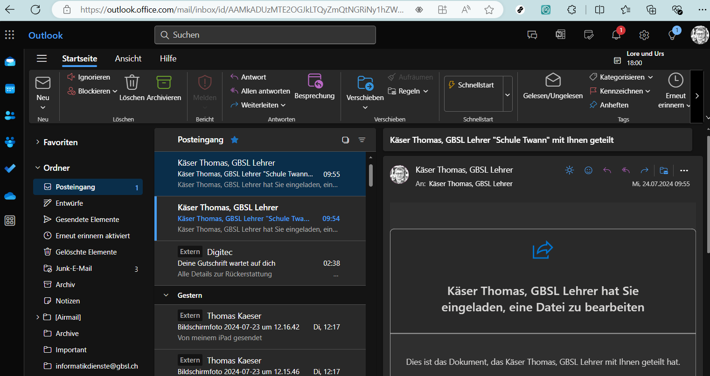
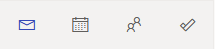

---
apps:
  - outlook
sidebar_label: Outlook dans le navigateur
sidebar_custom_props:
  icon: mdi-microsoft-outlook
  source: gym-kirchenfeld
draft: false
---

# Outlook dans le navigateur

:::warning[Lien direct]

https://outlook.office.com/mail/
:::

Connecte-toi avec ton adresse e-mail scolaire et ton mot de passe.

## Rédiger un e-mail

Pour créer un nouvel e-mail, clique en haut à gauche sur **Nouveau**.

Ajoute les destinataires, le sujet et le texte. Tu peux envoyer ton message en cliquant sur _Envoyer_.

Toutes les adresses e-mail des élèves, des enseignant·e·s, du personnel et toutes les listes de diffusion sont automatiquement complétées lors de la saisie.

Tu peux afficher le champ _CCI_ en cliquant sur _CCI_ tout à droite dans le champ _À_.

## Calendrier et contacts

Outlook propose, en plus des e-mails, une fonction de calendrier, des contacts ainsi que des tâches. Tu peux accéder à ces sections via les petites icônes dans la barre latérale à gauche.

