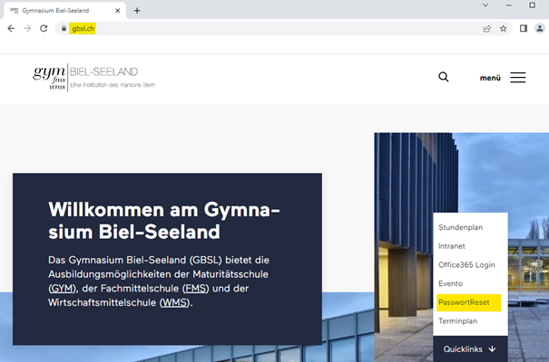
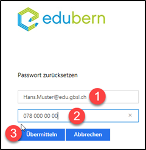
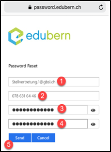

---
sidebar_custom_props:
  icon: mdi-email-edit
  source: 
  path: /i18n\fr\docusaurus-plugin-content-docs\current\schulkonto\ersteinrichtung\README.md
sidebar_position: 5
draft: false
---

# Compte scolaire

Tous nos services utilisent un compte utilisateur centralisé. Cela signifie que tu n'as besoin de mémoriser **qu'un seul mot de passe**.

Tous les élèves du Gymnase Bienne-Seeland reçoivent une adresse e-mail scolaire personnelle, associée aux applications Office365 de Microsoft. Cette adresse e-mail est utilisée pour la communication officielle de l'école.

Ce compte inclut, pendant toute la durée de la formation :

- un compte e-mail, sous la forme `Prénom.Nom@edu.gbsl.ch`
- un pack Microsoft Office365 (Word, Excel, PowerPoint, etc.), qui peut être installé et utilisé librement sur jusqu'à cinq appareils (ordinateur ou téléphone mobile)
- un espace de stockage cloud étendu (5 To) sur Microsoft OneDrive

## Initialisation

1. Ouvre un navigateur Internet et rends-toi sur le site web du Gymnase Bienne-Seeland : www.gbsl.ch

2. Clique sur le menu « Quicklinks » et sélectionne « Réinitialisation du mot de passe ».

3. Saisis ton adresse e-mail scolaire (`Prénom.Nom@edu.gbsl.ch` pour les élèves ou Prénom.Nom@gbsl.ch pour les enseignants) ainsi que ton numéro de mobile au format 07x xxx xx xx. Ensuite, clique sur « Soumettre ».

   - **Important :** Utilise ton numéro de mobile personnel, celui que tu as indiqué sur les formulaires d'inscription de l'école.

4. Si tes informations sont correctes, tu recevras un SMS avec un lien. Le SMS sera envoyé au numéro de mobile que tu as saisi à l'étape 3. Clique sur le lien contenu dans le SMS.
   - **Si un message d'erreur apparaît ou si tu ne reçois pas de SMS, contacte le secrétariat au 032 327 07 07 ou à l'adresse sekretariat@gbsl.ch.**

5. Une nouvelle fenêtre s'ouvrira alors dans ton navigateur mobile, te permettant de définir un mot de passe pour ton compte e-mail scolaire.

   1. Saisis ton adresse e-mail scolaire (`Prénom.Nom@edu.gbsl.ch`).
   2. Saisis ton numéro de mobile personnel, celui que tu as utilisé à l'étape 3.
   3. Saisis ton nouveau mot de passe.
   4. Confirme ton nouveau mot de passe.
   5. Clique sur « Envoyer ».

   **Respecte les exigences suivantes pour le mot de passe !**
   - Au moins 8 caractères
   - Au moins une majuscule et une minuscule
   - Au moins un chiffre
   - Au moins un caractère spécial (par ex. * ? ! $ etc.)
   - Ton prénom ou ton nom ne doivent pas être inclus

6. Un message de confirmation t'indiquera que ton mot de passe a été défini avec succès.

   - **Si tu reçois un message d'erreur, contacte le secrétariat au __032 327 07 07__ ou à l'adresse sekretariat@gbsl.ch.**

## Réinitialisation du mot de passe

Tu peux réinitialiser ton mot de passe ici si tu l'as oublié : [👉 Réinitialiser le mot de passe](https://password.edubern.ch/)

## Important : Configurer l'authentification multifactorielle
Pour des raisons de sécurité, il est souvent exigé, en plus du mot de passe, une autre méthode d'authentification, appelée MFA, authentification multifactorielle. Depuis chez toi, par exemple, tu dois te connecter ainsi aux services de l'école.

Avec le numéro de ton smartphone, tu devrais déjà avoir configuré une telle méthode. Pour vérifier si c'est le cas et savoir quoi faire si ce n'est pas fait : [👉 Configurer la MFA](../fr/schulkonto/mfa/README.md)