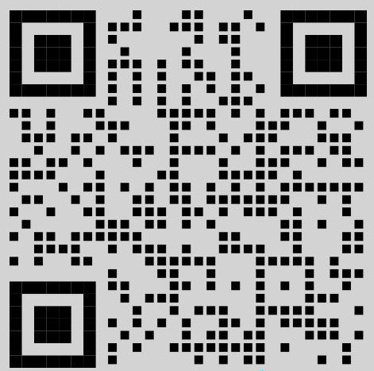
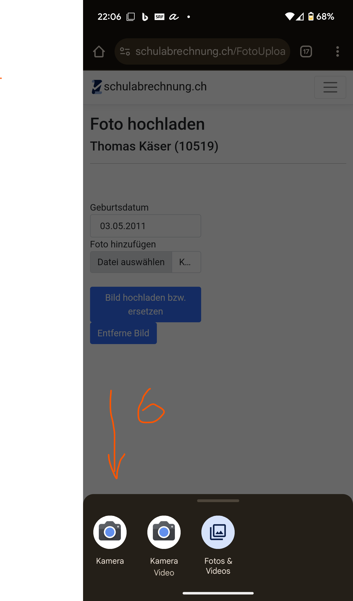
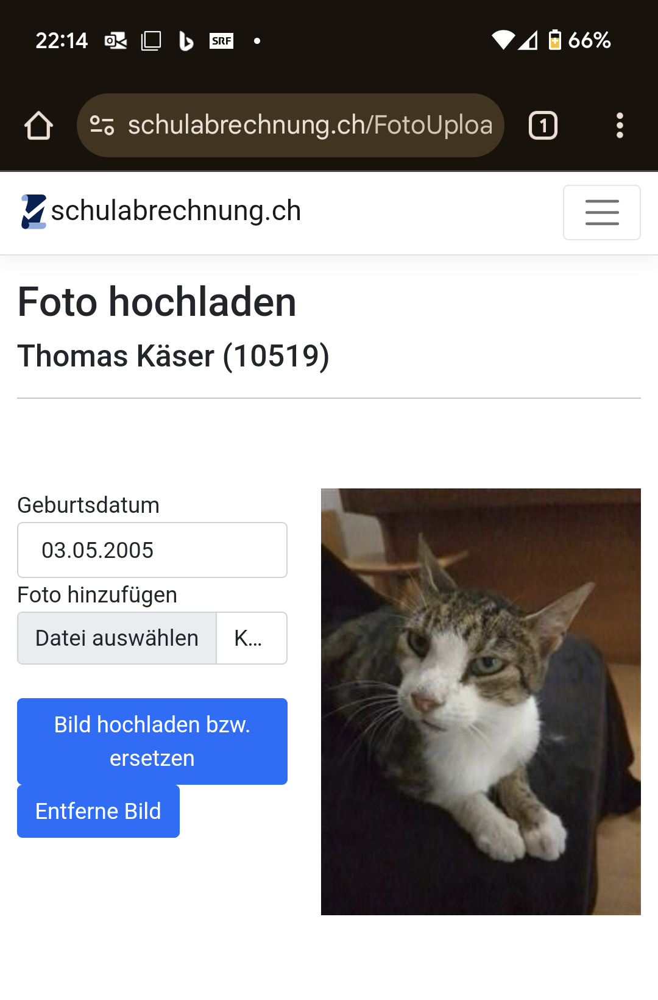

# Prendre une photo pour la carte d’élève

Tous les élèves du Gymnase Bienne-Seeland reçoivent une carte d’élève personnelle au début de leur scolarité. Celle-ci permet de :

- emprunter des livres à la bibliothèque
- faire des copies et imprimer à la bibliothèque en chargeant un crédit sur la carte
- ouvrir des portes (selon les autorisations personnelles, p. ex. salles de musique, ascenseur, etc.)

La photo est enregistrée dans la base de données interne et est visible par les enseignant·e·s.

---
### Exigences concernant la photo :

- Cadre adapté (visage)
- Fond clair et uni
- Les accessoires (p. ex. bonnets, lunettes de soleil) ne sont pas autorisés

:::solution[Exemples de photos]
_Seite_1.jpg)
_Seite_2.jpg)
_Seite_3.jpg)

(Source: fedpol.ch)
:::

---

## Prendre et télécharger la photo

Tu peux effectuer l’ensemble du processus avec ton smartphone.

:::solution[Clique ici pour le code QR]

:::

:::details[Instructions pour iPhone]

1. Ouvre ce lien : [https://schulabrechnung.ch](https://schulabrechnung.ch)
2. Connecte-toi avec ton **compte e-mail scolaire**
3. Sélectionne l’onglet **Télécharger une photo**
4. Saisis ta date de naissance
5. Clique sur Ajouter un fichier

6. Une fenêtre s’ouvre dans laquelle tu cliques sur **Prendre une photo ou une vidéo** :

Ensuite, prends la photo pour la carte d’élève et clique sur **Utiliser la photo**. Le site **schulabrechnung.ch** s’ouvre à nouveau.

7. Tu vois maintenant l’image comme une petite icône dans le champ (8). Vérifie que l’extension du fichier est __jpg__. (Tu devras peut-être tourner ton téléphone en mode paysage pour vérifier cela). Si l’extension est différente, tu dois utiliser la méthode alternative pour créer la photo plus bas.

Si l’extension est correcte, clique sur **Télécharger l’image** et attends un instant jusqu’à ce que tu voies ton image affichée plus grande à droite. Si c’est le cas, l’image a été téléchargée avec succès. Si la photo ne correspond pas à une photo passeport correcte, tu dois utiliser la méthode alternative indiquée plus bas.

:::

:::details[Instructions pour téléphone Android]

1. Ouvre ce lien : [https://schulabrechnung.ch](https://schulabrechnung.ch)
2. Connecte-toi avec ton **compte e-mail scolaire**
3. Sélectionne l’onglet **Télécharger une photo**
4. Saisis ta date de naissance
5. Clique sur Ajouter un fichier

6. Une fenêtre s’ouvre dans laquelle tu cliques sur **Caméra** :

Ensuite, prends la photo pour la carte d’élève et clique sur **Utiliser la photo**. Le site **schulabrechnung.ch** s’ouvre à nouveau.

7. Tu vois maintenant l’image comme une petite icône dans le champ (8), clique sur **Télécharger l’image** et attends un instant jusqu’à ce que tu voies ton image affichée plus grande à droite.

:::

:::solution[Le format de ta photo n’est pas __.jpg__ ou la photo ne correspond pas à un passeport valide]

Utilise la fonction selfie de ton téléphone portable ou fais-toi prendre en photo.

Enregistre l’image sur ton ordinateur. Par exemple, tu peux te l’envoyer par e-mail et l’ouvrir ensuite sur ton PC.

---

### Mac

1. Ouvre le fichier photo avec l’application **«Aperçu»**.
2. Sélectionne **Fichier > Exporter**, puis choisis le format **JPEG** dans le champ **Format**.

### Windows

1. Ouvre la photo avec l’application **«Photos»**.
2. Clique sur les trois points en haut à droite **(...)** et sélectionne **Enregistrer sous**.
3. Choisis le format **.jpg** comme type de fichier.

---

## Télécharger la photo

1. Ouvre ce lien : [https://schulabrechnung.ch](https://schulabrechnung.ch)
2. Connecte-toi avec ton **compte e-mail scolaire**
3. Télécharge ta photo et saisis ta **date de naissance**

👉 [Télécharger une photo – Schulabrechnung](https://schulabrechnung.ch)
:::
---

Si tu as des questions, contacte-nous :

📞 **032 327 07 07**

✉️ **[sekretariat@gbsl.ch](mailto:sekretariat@gbsl.ch?subject=Question%20concernant%20la%20carte%20d’élève&body=Bonjour%2C%0A%0AJ’ai%20une%20courte%20question%20concernant%20la%20carte%20d’élève%20:%0A%0ACordialement%2C%0A%5BTon%20nom%5D)**
