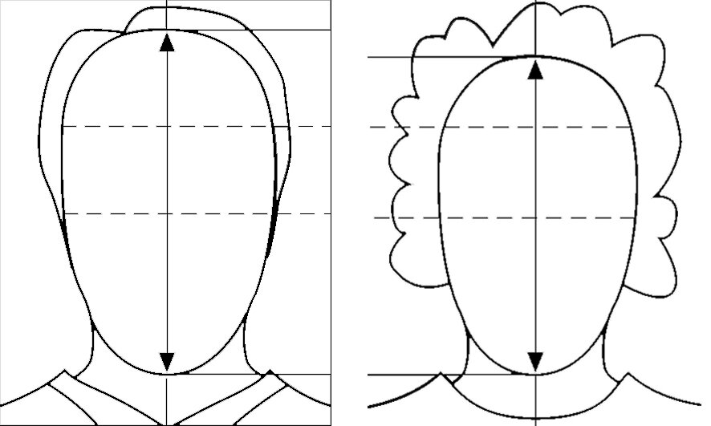
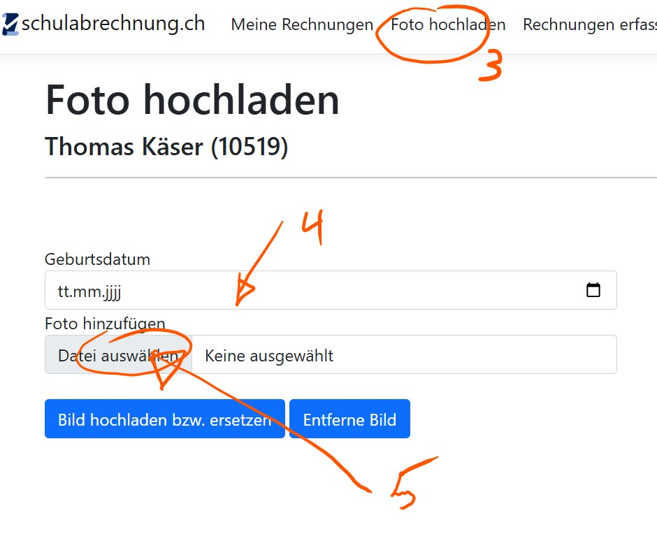

# Prendre une photo pour la carte scolaire

Tous les élèves du Gymnase Bienne-Seeland reçoivent une carte scolaire personnelle au début de leur scolarité. Celle-ci leur permet de :

- Emprunter des livres à la bibliothèque
- Copier et imprimer à la bibliothèque en rechargeant un crédit sur la carte
- Ouvrir des portes (selon les autorisations personnelles, par ex. salles de musique, ascenseur, etc.)

La photo est enregistrée dans la base de données interne et est visible par les enseignant·e·s.

---
### Exigences pour la photo :

- Cadrage adapté (visage visible)
- Fond clair et uni
- Accessoires (p. ex. bonnets, lunettes de soleil) interdits

---

## Prendre et télécharger la photo

:::details[Instructions pour iPhone]
Tu peux effectuer toute la procédure avec ton iPhone.

1. Ouvre ce lien : [https://schulabrechnung.ch](https://schulabrechnung.ch)
2. Connecte-toi avec ton **compte e-mail scolaire**.
3. Clique sur l’onglet **Télécharger une photo**
4. Entre ta date de naissance
5. Clique sur Ajouter un fichier

6. La fenêtre suivante s’ouvre, clique sur **Prendre une photo ou une vidéo** :

Ensuite, prends la photo pour la carte scolaire et clique sur **Utiliser la photo**. La page **schulabrechnung.ch** réapparaît.

7. Tu vois maintenant la photo comme une petite icône dans le champ (8), clique sur **Télécharger la photo** et attends un moment jusqu’à ce que l’image apparaisse en plus grand à droite.

:::

:::details[Instructions pour smartphone Android]

Utilise la fonction selfie de ton téléphone portable ou fais-toi photographier.
---

## Format du fichier photo

Le fichier photo doit être enregistré au format **.jpg**. Si ce n’est pas le cas :

### Windows

1. Ouvre la photo avec l’application **« Photos »**.
2. Clique en haut à droite sur les trois points **(...)** et sélectionne **Enregistrer sous**.
3. Choisis le format **.jpg** sous **Type de fichier**.

---

## Télécharger la photo

1. Ouvre ce lien : [https://schulabrechnung.ch](https://schulabrechnung.ch)
2. Connecte-toi avec ton **compte e-mail scolaire**.
3. Télécharge ta photo et saisis ta **date de naissance**.

:::
---

Si vous avez des questions, veuillez contacter :

📞 **032 327 07 07**

✉️ **[sekretariat@gbsl.ch](mailto:sekretariat@gbsl.ch?subject=Question%20concernant%20la%20carte%20scolaire&body=Bonjour%2C%0A%0AJ’ai%20une%20courte%20question%20concernant%20la%20carte%20scolaire%20:%0A%0ACordialement%2C%0A%5BVotre%20nom%5D)**
